# Email Population - Architecture & Implementation Documentation

## 📋 Executive Summary

This document provides comprehensive architecture and implementation documentation for the Email Population component of the M365 Environment Population Tool. The solution automates the creation of realistic organizational emails in Microsoft 365 mailboxes using Microsoft Graph API and Exchange Web Services (EWS) for enterprise testing, demos, and training scenarios.

---

## 🏗️ System Architecture Overview

```mermaid
flowchart TB
    subgraph User Interface
        MENU[menu.py - Main Menu]
        POP_EMAIL[populate_emails.py - Email Population]
        CLEAN_EMAIL[cleanup_emails.py - Email Cleanup]
    end

    subgraph Configuration Layer
        MAILBOXES[config/mailboxes.yaml]
        SITES[config/sites.json]
        ENV[config/environments.json]
        APP_CONFIG[.app_config.json]
    end

    subgraph Email Generator Module
        CONFIG[config.py - Configuration Loader]
        CONTENT[content_generator.py - Content Generation]
        GRAPH[graph_client.py - Graph API Client]
        EWS[ews_client.py - EWS Client]
        THREADING[threading.py - Thread Manager]
        ATTACH[attachments.py - Attachment Generator]
        USER_POOL[user_pool.py - CC/BCC Pool]
        VARIATIONS[variations.py - Content Variations]
    end

    subgraph Templates
        NEWS[newsletter_templates.py]
        SP_TMPL[sharepoint_templates.py]
        ATTACH_TMPL[attachment_templates.py]
        ORG[organisational_templates.py]
        INTER[interdepartmental_templates.py]
        SEC[security_templates.py]
        SPAM[spam_templates.py]
        EXT[external_business_templates.py]
    end

    subgraph Microsoft 365 APIs
        GRAPH_API[Microsoft Graph API]
        EWS_API[Exchange Web Services]
        AAD[Microsoft Entra ID]
    end

    subgraph Exchange Online
        MAILBOX[User Mailboxes]
        FOLDERS[Mail Folders]
    end

    MENU --> POP_EMAIL
    MENU --> CLEAN_EMAIL
    
    POP_EMAIL --> MAILBOXES
    POP_EMAIL --> SITES
    POP_EMAIL --> ENV
    POP_EMAIL --> APP_CONFIG
    
    POP_EMAIL --> CONFIG
    CONFIG --> CONTENT
    CONTENT --> VARIATIONS
    CONTENT --> USER_POOL
    
    POP_EMAIL --> GRAPH
    POP_EMAIL --> EWS
    POP_EMAIL --> THREADING
    POP_EMAIL --> ATTACH
    
    CONTENT --> NEWS
    CONTENT --> SP_TMPL
    CONTENT --> ATTACH_TMPL
    CONTENT --> ORG
    CONTENT --> INTER
    CONTENT --> SEC
    CONTENT --> SPAM
    CONTENT --> EXT
    
    GRAPH --> GRAPH_API
    EWS --> EWS_API
    
    GRAPH_API --> AAD
    EWS_API --> AAD
    
    GRAPH_API --> MAILBOX
    EWS_API --> MAILBOX
    MAILBOX --> FOLDERS
```

---

## 🔧 Component Architecture

### 1. Core Components

| Component | File | Purpose |
|-----------|------|---------|
| Email Populator | [`populate_emails.py`](../scripts/populate_emails.py:1) | Main orchestration script |
| Email Cleanup | [`cleanup_emails.py`](../scripts/cleanup_emails.py:1) | Email deletion operations |
| Configuration Loader | [`email_generator/config.py`](../scripts/email_generator/config.py:1) | YAML/JSON configuration parsing |
| Content Generator | [`email_generator/content_generator.py`](../scripts/email_generator/content_generator.py:1) | Email content creation |
| Graph Client | [`email_generator/graph_client.py`](../scripts/email_generator/graph_client.py:1) | Microsoft Graph API operations |
| EWS Client | [`email_generator/ews_client.py`](../scripts/email_generator/ews_client.py:1) | Exchange Web Services operations |
| Thread Manager | [`email_generator/threading.py`](../scripts/email_generator/threading.py:1) | Email threading and conversations |
| Attachment Generator | [`email_generator/attachments.py`](../scripts/email_generator/attachments.py:1) | Document attachment creation |
| User Pool | [`email_generator/user_pool.py`](../scripts/email_generator/user_pool.py:1) | CC/BCC recipient management |
| Variations | [`email_generator/variations.py`](../scripts/email_generator/variations.py:1) | Content randomization pools |

### 2. Template Modules

| Template | File | Email Types |
|----------|------|-------------|
| Newsletters | [`templates/newsletter_templates.py`](../scripts/email_generator/templates/newsletter_templates.py:1) | Company and industry newsletters |
| SharePoint | [`templates/sharepoint_templates.py`](../scripts/email_generator/templates/sharepoint_templates.py:1) | Document sharing notifications |
| Attachments | [`templates/attachment_templates.py`](../scripts/email_generator/templates/attachment_templates.py:1) | Reports and documents |
| Organisational | [`templates/organisational_templates.py`](../scripts/email_generator/templates/organisational_templates.py:1) | Company announcements |
| Interdepartmental | [`templates/interdepartmental_templates.py`](../scripts/email_generator/templates/interdepartmental_templates.py:1) | Team communications |
| Security | [`templates/security_templates.py`](../scripts/email_generator/templates/security_templates.py:1) | Account and password alerts |
| Spam | [`templates/spam_templates.py`](../scripts/email_generator/templates/spam_templates.py:1) | Promotional and phishing |
| External Business | [`templates/external_business_templates.py`](../scripts/email_generator/templates/external_business_templates.py:1) | Vendor/partner communications |

---

## 📊 Data Flow Architecture

### Email Creation Flow

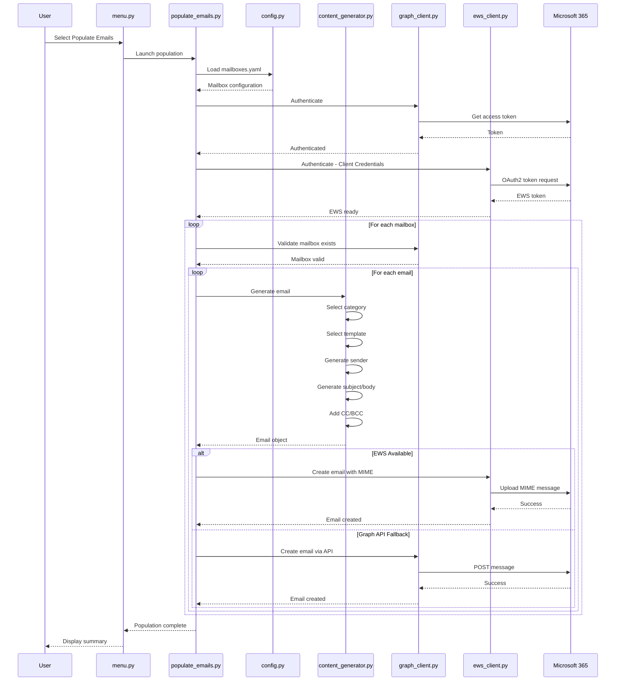

### Email Cleanup Flow

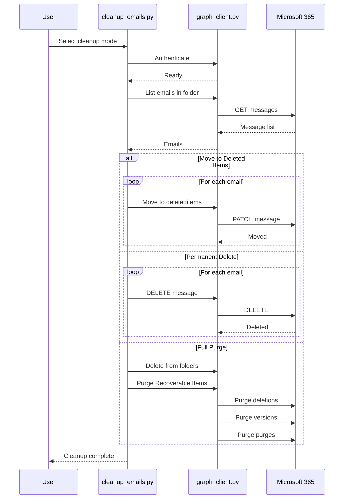

---

## 🔐 Authentication Architecture

### Dual Authentication Strategy

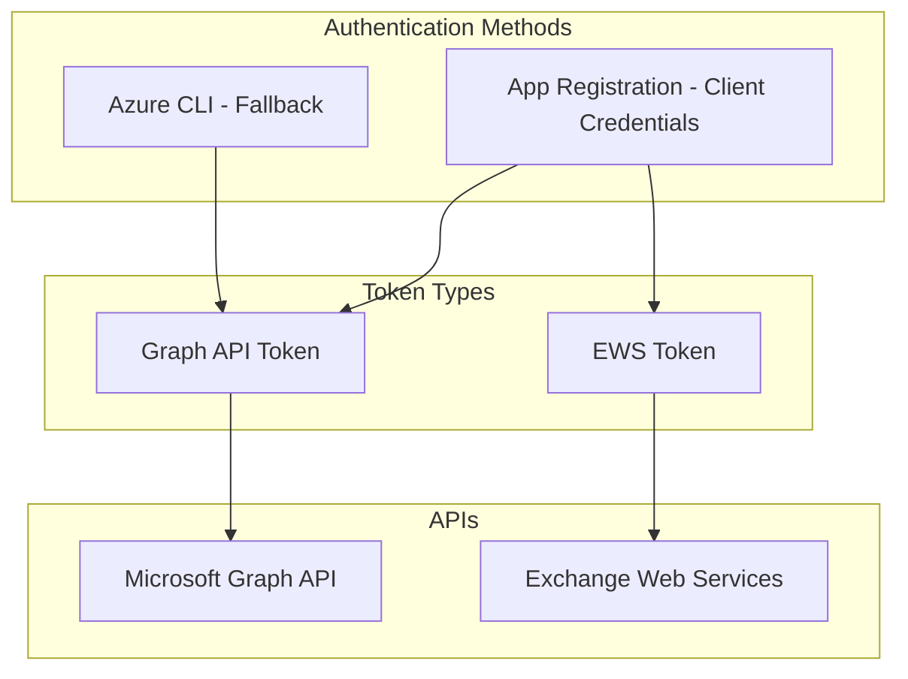

### Required Permissions

| API | Permission | Type | Purpose |
|-----|------------|------|---------|
| Microsoft Graph | `Mail.ReadWrite` | Application | Create/read/delete emails |
| Microsoft Graph | `Mail.Send` | Application | Send emails on behalf of users |
| Microsoft Graph | `User.Read.All` | Application | Azure AD user discovery |
| Exchange Online | `full_access_as_app` | Application | Full mailbox access via EWS |

### EWS vs Graph API Comparison

| Feature | EWS | Graph API |
|---------|-----|-----------|
| Backdated timestamps | ✅ Full control | ❌ Read-only |
| No Draft prefix | ✅ Proper received emails | ❌ May show as draft |
| Read/unread status | ✅ Full control | ✅ Full control |
| All folders | ✅ Supported | ✅ Supported |
| MIME upload | ✅ Native support | ❌ Not supported |
| Rate limits | More lenient | Stricter |

---

## 📧 Email Categories & Distribution

### Category Distribution

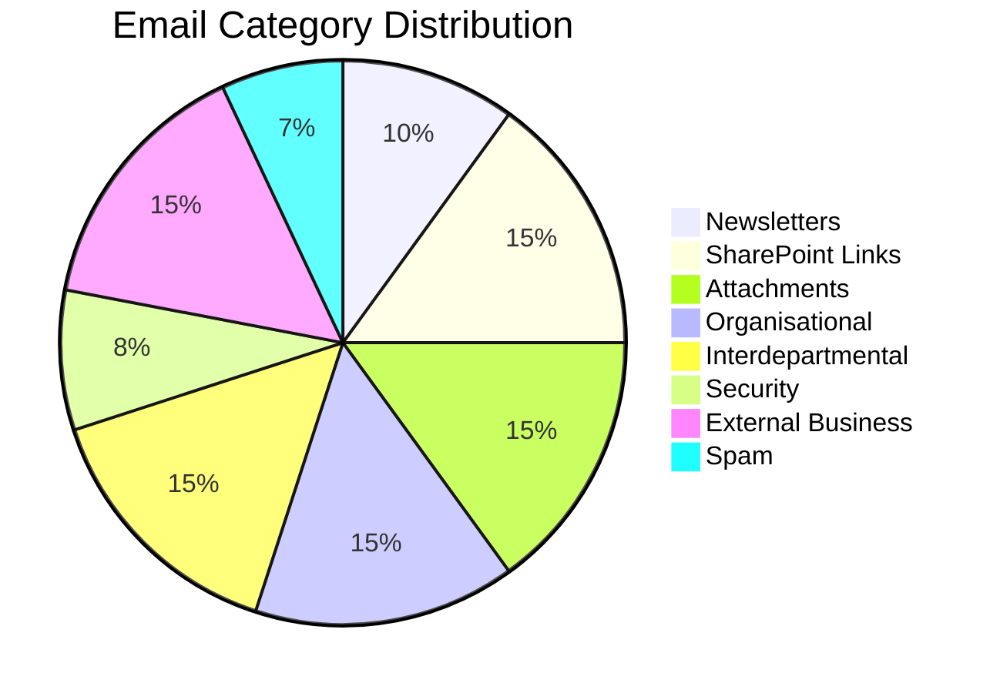

### Category Details

| Category | Default % | Description | Sender Type |
|----------|-----------|-------------|-------------|
| 📰 Newsletters | 10% | Company and industry newsletters | Internal system |
| 🔗 SharePoint Links | 15% | Document sharing notifications | Internal users |
| 📎 Attachments | 15% | Reports and documents | Internal users |
| 📢 Organisational | 15% | Company-wide communications | Internal system |
| 💬 Interdepartmental | 15% | Team and project communications | Internal users |
| 🔒 Security | 8% | Account and password notifications | Internal system |
| 🏢 External Business | 15% | Vendor/partner communications | External business |
| 🗑️ Spam | 7% | Promotional and phishing | External spam |

---

## 📁 Folder Distribution Architecture

### Weighted Folder Distribution

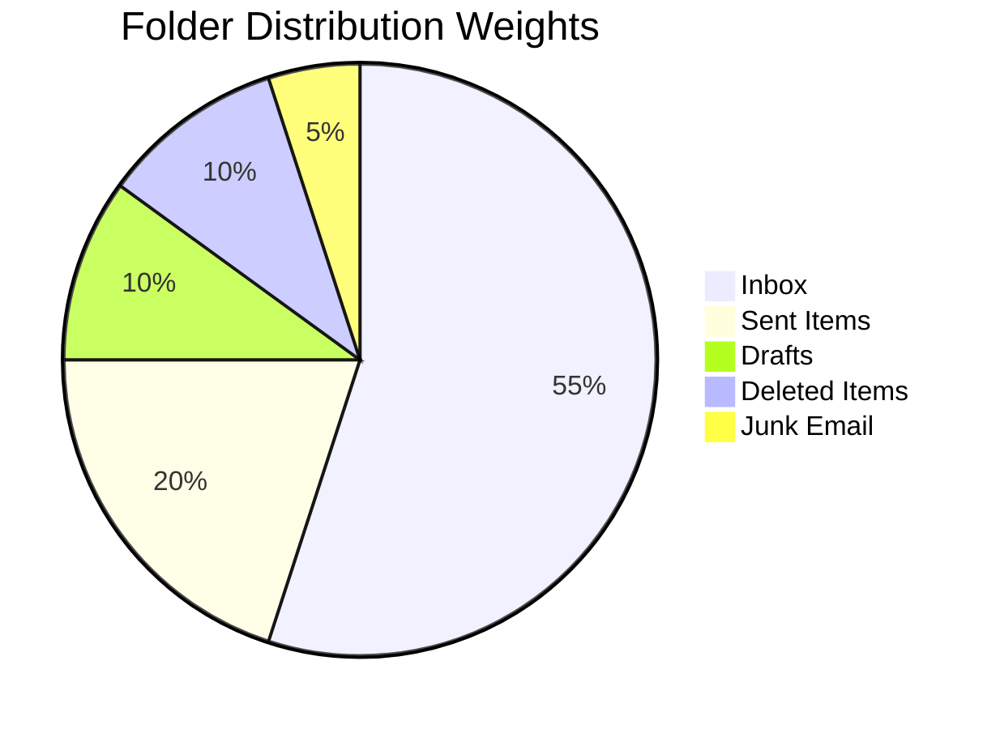

### Folder Routing Logic

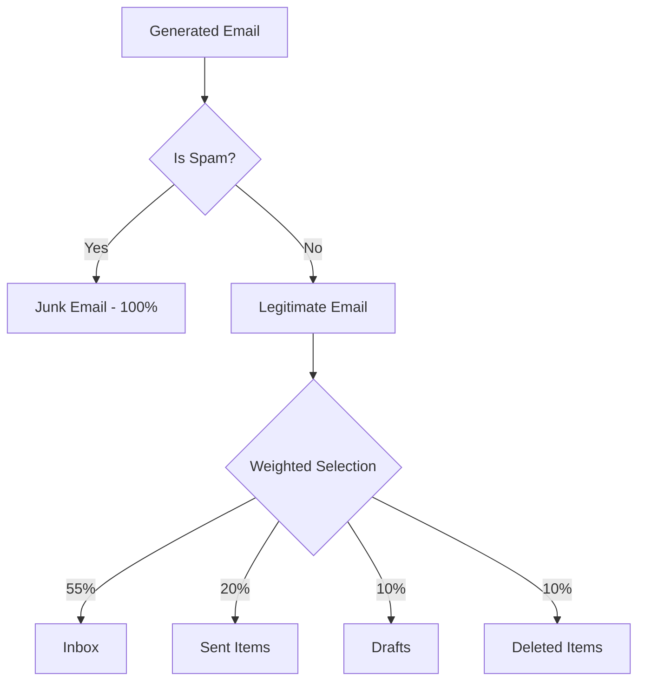

### Folder Configuration

| Folder | Graph API Name | Weight | Description |
|--------|----------------|--------|-------------|
| 📥 Inbox | `inbox` | 55% | Received emails |
| 📤 Sent Items | `sentitems` | 20% | Sent emails |
| 📝 Drafts | `drafts` | 10% | Draft emails |
| 🗑️ Deleted Items | `deleteditems` | 10% | Deleted emails |
| 🗑️ Junk Email | `junkemail` | 5% | Spam/junk emails |

---

## 🧵 Email Threading Architecture

### Threading Probabilities by Category

| Category | Threading % | Description |
|----------|-------------|-------------|
| Interdepartmental | 55% | Lots of internal back-and-forth |
| External Business | 50% | Client/vendor conversations |
| Attachments | 40% | Document review discussions |
| Organisational | 35% | HR/policy discussions |
| Links | 25% | Shared link discussions |
| Security | 20% | Security follow-ups |
| Newsletters | 0% | Never threaded |
| Spam | 0% | Never threaded |

### Thread Types

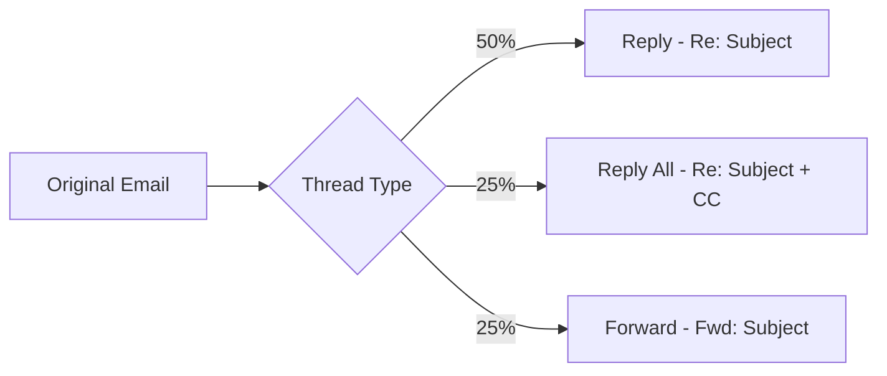

### Thread Headers

| Header | Purpose |
|--------|---------|
| `In-Reply-To` | References parent message ID |
| `References` | Full thread message chain |
| `Thread-Topic` | Conversation topic |
| `Thread-Index` | Outlook thread tracking |

---

## 📎 Attachment Generation

### Attachment Types

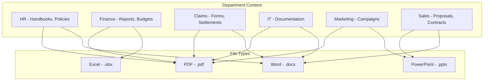

### Attachment Configuration

```yaml
settings:
  include_attachments: true
  attachment_probability: 0.3
```

---

## 🎭 Content Variation System

### Variation Architecture

```mermaid
flowchart TB
    subgraph Variation Pools
        GREETINGS[Greetings - Formal/Informal/Team]
        CLOSINGS[Closings - Formal/Informal/Professional]
        PROJECTS[Project Names - Codenames + Descriptors]
        DOCUMENTS[Document Names - Department-specific]
        MEETINGS[Meeting Topics - Various types]
        EMPLOYEES[Employee Names - Diverse pool]
        NEWS[Company News - Launches, Achievements]
        EVENTS[Events - Town halls, Training]
    end

    subgraph Department Context
        JARGON[Department Jargon]
        PRIORITIES[Current Priorities]
        METRICS[Key Metrics/KPIs]
        CONTACTS[Support Channels]
    end

    subgraph Time Context
        QUARTER[Current Quarter]
        FISCAL[Fiscal Year]
        DEADLINES[Random Deadlines]
        DATES[Date References]
    end

    subgraph Tone Variations
        URGENCY[Urgency Levels]
        REQUESTS[Polite Requests]
        ACKS[Acknowledgments]
        FOLLOWUP[Follow-up Phrases]
    end

    GREETINGS --> EMAIL[Generated Email]
    CLOSINGS --> EMAIL
    PROJECTS --> EMAIL
    DOCUMENTS --> EMAIL
    MEETINGS --> EMAIL
    EMPLOYEES --> EMAIL
    NEWS --> EMAIL
    EVENTS --> EMAIL
    
    JARGON --> EMAIL
    PRIORITIES --> EMAIL
    METRICS --> EMAIL
    CONTACTS --> EMAIL
    
    QUARTER --> EMAIL
    FISCAL --> EMAIL
    DEADLINES --> EMAIL
    DATES --> EMAIL
    
    URGENCY --> EMAIL
    REQUESTS --> EMAIL
    ACKS --> EMAIL
    FOLLOWUP --> EMAIL
```

### Greeting Variations

| Type | Examples |
|------|----------|
| Formal | Dear {name}, Good morning {name} |
| Informal | Hi {name}, Hey {name} |
| Team | Hi Team, Hello Everyone, Dear Colleagues |

### Closing Variations

| Type | Examples |
|------|----------|
| Formal | Best regards, Sincerely, Respectfully |
| Informal | Thanks, Cheers, Talk soon |
| Professional | Best, Kind regards, Thank you |

---

## 📅 Date Distribution

### Temporal Distribution

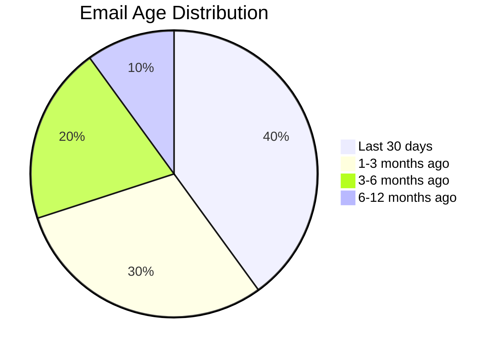

### Date Generation Rules

| Factor | Configuration | Default |
|--------|---------------|---------|
| Date Range | `date_range_months` | 12 months |
| Business Hours Bias | `business_hours_bias` | 80% during 8 AM - 6 PM |
| Weekday Bias | Implicit | 90% on weekdays |
| Recent Bias | Weighted | 40% in last 30 days |

---

## 🔒 Security Email Templates

### Security Email Types

| Type | Description | Contains Password |
|------|-------------|-------------------|
| Account Blocked | Account locked notification | No |
| Password Reset with Temp | Temporary password provided | Yes |
| Password Reset Link | Reset link only | No |
| Account Unlocked | Account restored notification | No |
| Suspicious Activity | Unusual sign-in warning | No |

### Temporary Password Generation

```python
# Password characteristics:
# - 12-16 characters
# - Mix of uppercase, lowercase, numbers, special characters
# - Avoids ambiguous characters (0/O, 1/l/I)
# Example: Kp7#mNx$Qw3&Yz
```

---

## 🏢 External Business Emails

### External Email Types

| Type | Description |
|------|-------------|
| Follow-up | Post-meeting follow-ups, action items |
| Proposals | Business proposals, partnership opportunities |
| Meeting Requests | External meeting scheduling |
| Project Updates | Status updates from external partners |
| Invoices | Legitimate billing communications |
| Contract Discussions | Contract reviews, negotiations |
| Introductions | Business introductions, networking |
| Thank You Notes | Appreciation for business relationships |
| Support Tickets | Customer support communications |
| Event Invitations | Conference invites, webinar registrations |
| Product Updates | Vendor product announcements |
| Feedback Requests | Survey and feedback requests |

### External Domains

```
acme-consulting.com
globaltech-solutions.com
premier-services.net
innovate-partners.com
enterprise-systems.io
strategic-advisors.com
```

---

## 🗑️ Spam Email Architecture

### Spam Types

| Type | Description | Routing |
|------|-------------|---------|
| Promotional Spam | Flash sales, discount offers | 85% Junk, 15% Inbox |
| Phishing Simulations | Fake security alerts | 85% Junk, 15% Inbox |
| Lottery Scams | Prize notifications | 85% Junk, 15% Inbox |
| Fake Invoices | Fraudulent billing | 85% Junk, 15% Inbox |
| Newsletter Spam | Clickbait articles | 85% Junk, 15% Inbox |

### Spam Sender Rule

> **IMPORTANT**: Spam emails ALWAYS use external spam senders. Internal users will NEVER appear as spam senders.

---

## ⚡ Rate Limiting Architecture

### Rate Limiting Configuration

```yaml
rate_limiting:
  request_delay_ms: 100    # Delay between individual requests
  batch_delay_ms: 500      # Delay between batches
  max_retries: 5           # Maximum retry attempts
```

### Retry Strategy

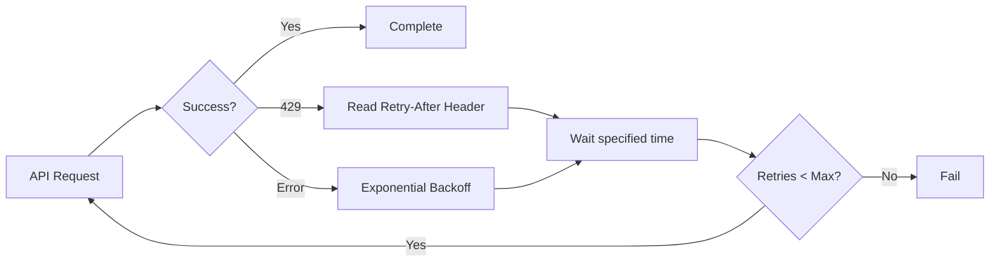

### Recommended Settings

| Scenario | request_delay_ms | batch_delay_ms | max_retries |
|----------|------------------|----------------|-------------|
| Small batches - under 50 emails | 50 | 200 | 3 |
| Medium batches - 50-200 | 100 | 500 | 5 |
| Large batches - 200+ | 200 | 1000 | 7 |

### EWS vs Graph API Rate Limits

| Setting | EWS | Graph API |
|---------|-----|-----------|
| Timeout | 90 seconds | 30 seconds |
| Max Retries | 3 | 5 |
| Backoff | 2s, 4s, 8s | 1s, 2s, 4s, 8s, 16s |
| Request Delay | 50ms | 100ms |

---

## 👥 CC/BCC Architecture

### User Pool Configuration

```yaml
cc_bcc:
  enabled: true
  cc_probability: 0.3      # 30% of emails have CC
  bcc_probability: 0.1     # 10% of emails have BCC
  max_cc_recipients: 3
  max_bcc_recipients: 2
  prefer_same_department: true
  include_managers: true
```

### Azure AD Discovery

```yaml
azure_ad:
  enabled: true
  discover_users: true
  discover_groups: true
  cache:
    enabled: true
    ttl_minutes: 60
    path: ".azure_ad_cache.json"
  user_filter:
    include_guests: false
    require_mail: true
  group_filter:
    types:
      - unified  # Microsoft 365 Groups
      - security
    max_members: 50
```

---

## 🚫 Exclusions System

### Exclusion Configuration

```yaml
exclusions:
  enabled: true
  email_addresses:
    - admin@contoso.onmicrosoft.com
  domains:
    - external.com
  patterns:
    - "test-*@*"
  exclude_no_mailbox: true
  log_exclusions: true
```

### Exclusion Flow

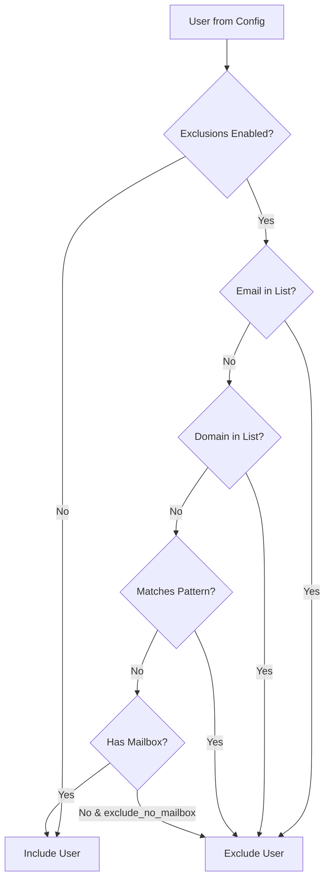

---

## 🗑️ Email Cleanup Architecture

### Cleanup Modes

| Mode | Description | Recoverable |
|------|-------------|-------------|
| Move to Deleted Items | Emails can be recovered | Yes |
| Permanently Delete | Emails deleted but may be in Recoverable Items | Partially |
| Full Purge | Truly unrecoverable - purges Recoverable Items | No |

### Recoverable Items Folders

| Folder | Purpose |
|--------|---------|
| `recoverableitemsdeletions` | Soft-deleted items |
| `recoverableitemsversions` | Previous versions |
| `recoverableitemspurges` | Items pending purge |

### Retention Policy Handling

> **Note**: Items protected by Microsoft 365 retention policies cannot be purged. The tool automatically detects protected items and stops processing when only protected items remain.

---

## 📊 Email Properties

### Importance Levels

| Level | Distribution | Description |
|-------|--------------|-------------|
| Normal | 75% | Standard priority |
| High | 15% | Urgent/important emails |
| Low | 10% | Low priority/FYI emails |

### Outlook Color Categories

| Category | Email Types |
|----------|-------------|
| 🔵 Blue | IT, Attachments |
| 🟢 Green | Sales, Links |
| 🟡 Yellow | Finance, External Business |
| 🟠 Orange | Marketing, Security |
| 🟣 Purple | HR, Newsletters |
| 🔴 Red | Executive, Legal, Security |

### Read/Unread Patterns

| Factor | Effect |
|--------|--------|
| Email Age | Older emails more likely read |
| Importance | High importance more likely read |
| Category | Spam often left unread |
| Recency | Emails under 3 days have higher unread rate |

### Sensitivity Labels

| Label | Distribution | Description |
|-------|--------------|-------------|
| General | 40% | Public information |
| Internal | 35% | Internal use only |
| Confidential | 20% | Sensitive business data |
| Highly Confidential | 5% | Restricted access |

---

## 🔄 Error Handling

### Common Errors

| Error | Cause | Solution |
|-------|-------|----------|
| Access Denied | Missing Mail.ReadWrite permission | Grant admin consent |
| User Not Found | Invalid UPN in config | Verify mailboxes.yaml |
| Rate Limited (429) | Too many API calls | Automatic retry with backoff |
| EWS Auth Failed | Missing client secret | Regenerate via App Registration |
| PyYAML Not Installed | Missing dependency | `pip install pyyaml` |

### EWS Fallback

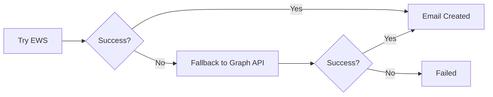

---

## 📈 Statistics & Monitoring

### Population Statistics

```python
stats = {
    "total_emails": 0,
    "successful": 0,
    "failed": 0,
    "mailboxes_processed": 0,
    "start_time": None,
    "end_time": None,
    "by_category": {},
}
```

### Progress Display

- Real-time progress bar with percentage
- Current email subject preview
- Folder distribution tracking
- Color-coded status messages

---

## 🔗 Integration Points

### External Dependencies

| Dependency | Version | Purpose |
|------------|---------|---------|
| Python | 3.8+ | Script execution |
| PyYAML | 6.0+ | YAML configuration parsing |
| exchangelib | 5.0+ | EWS operations - optional |
| Azure CLI | 2.50.0+ | Azure authentication |

### API Endpoints

| API | Endpoint | Purpose |
|-----|----------|---------|
| Microsoft Graph | `https://graph.microsoft.com/v1.0` | Email operations |
| Exchange Online | `https://outlook.office365.com/EWS/Exchange.asmx` | EWS operations |
| Azure AD | `https://login.microsoftonline.com/{tenant}/oauth2/v2.0/token` | Token acquisition |

---

## 📚 Configuration Reference

### mailboxes.yaml Structure

```yaml
settings:
  default_email_count: 100
  date_range_months: 12
  business_hours_bias: 0.8
  thread_probability: 0.4
  internal_sender_ratio: 0.6

users:
  - upn: john.smith@contoso.com
    role: HR Manager
    department: Human Resources
    email_volume: high

  - upn: jane.doe@contoso.com
    role: Financial Analyst
    department: Finance
    email_volume: medium

exclusions:
  enabled: true
  email_addresses:
    - admin@contoso.onmicrosoft.com
  domains:
    - external.com

azure_ad:
  enabled: true
  discover_users: true
  discover_groups: true

cc_bcc:
  enabled: true
  cc_probability: 0.3
  bcc_probability: 0.1

rate_limiting:
  request_delay_ms: 100
  batch_delay_ms: 500
  max_retries: 5
```

---

## 📚 Related Documentation

| Document | Description |
|----------|-------------|
| [README.md](../README.md) | Main project documentation |
| [EMAIL_POPULATION.md](../docs/EMAIL_POPULATION.md) | Detailed email population guide |
| [TROUBLESHOOTING.md](../docs/TROUBLESHOOTING.md) | Common issues and solutions |
| [SHAREPOINT_ARCHITECTURE.md](./SHAREPOINT_ARCHITECTURE.md) | SharePoint architecture documentation |

---

## 📝 Version History

| Version | Date | Changes |
|---------|------|---------|
| 1.0 | 2024 | Initial architecture documentation |
