# SharePoint Sites Deployment - Architecture & Implementation Documentation

## 📋 Executive Summary

This document provides comprehensive architecture and implementation documentation for the SharePoint Sites deployment component of the M365 Environment Population Tool. The solution automates the creation and population of SharePoint Online sites using Terraform for infrastructure orchestration and Microsoft Graph API for site provisioning.

---

## 🏗️ System Architecture Overview

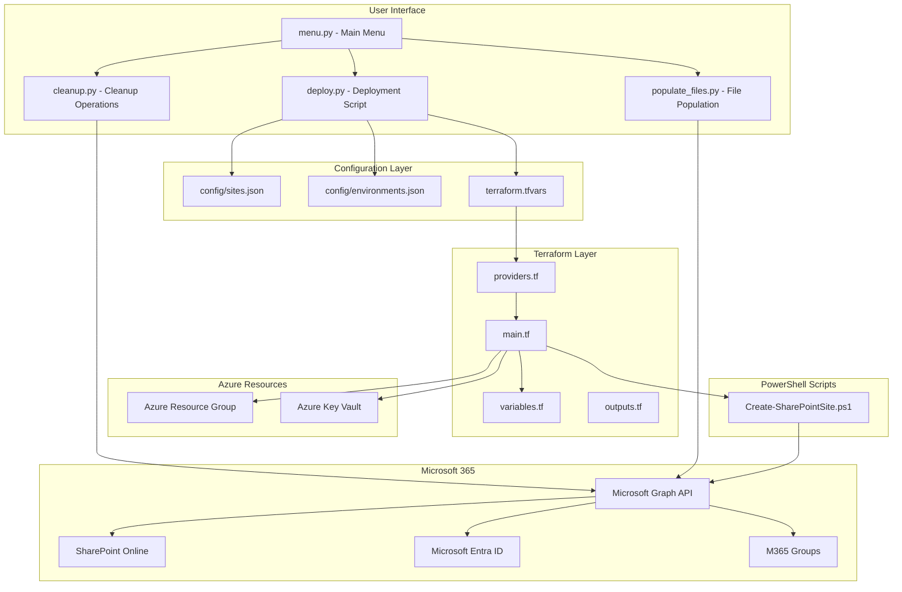

---

## 🔧 Component Architecture

### 1. Entry Points

| Component | File | Purpose |
|-----------|------|---------|
| Main Menu | [`menu.py`](../scripts/menu.py:1) | Interactive CLI for all operations |
| Deployment | [`deploy.py`](../scripts/deploy.py:1) | SharePoint site creation orchestration |
| File Population | [`populate_files.py`](../scripts/populate_files.py:1) | Document generation and upload |
| Cleanup | [`cleanup.py`](../scripts/cleanup.py:1) | Site and file deletion operations |

### 2. Configuration Files

| File | Purpose | Key Settings |
|------|---------|--------------|
| [`config/sites.json`](../config/sites.json:1) | Site definitions | Site names, descriptions, visibility, exclusions |
| [`config/environments.json`](../config/environments.json:1) | Environment presets | Tenant ID, Subscription ID, M365 settings |
| [`terraform/terraform.tfvars`](../terraform/terraform.tfvars.example:1) | Terraform variables | Azure and M365 configuration values |

### 3. Terraform Infrastructure

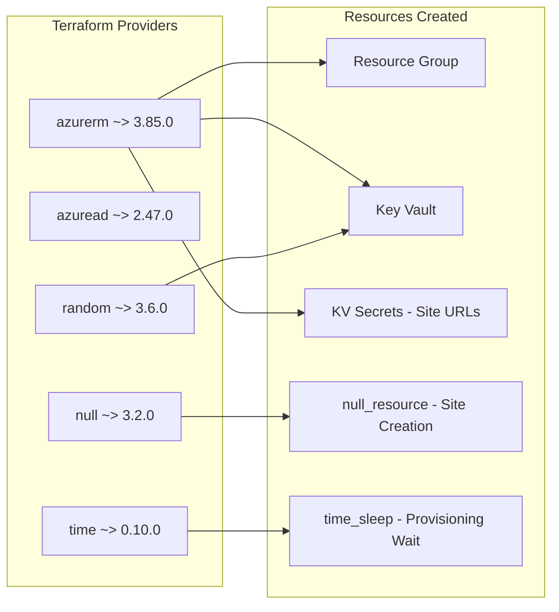

---

## 📊 Data Flow Architecture

### Site Creation Flow

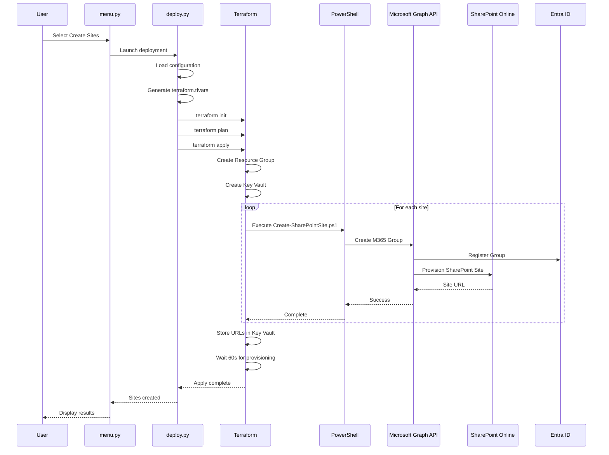

### File Population Flow

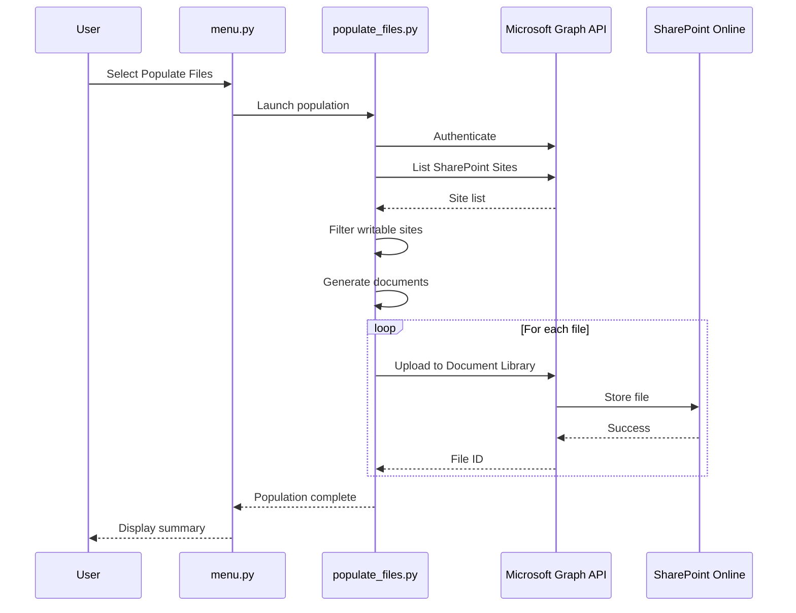

---

## 🔐 Authentication Architecture

### Authentication Methods

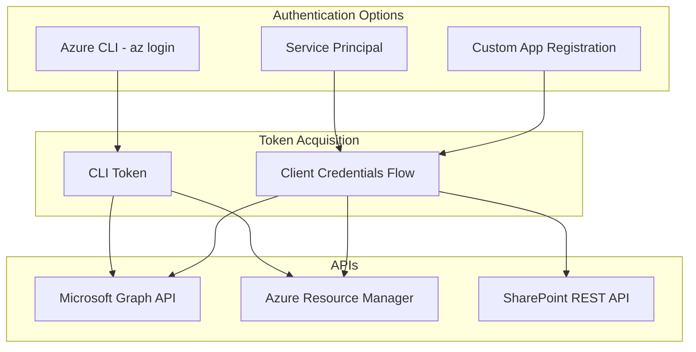

### Required Permissions

| API | Permission | Type | Purpose |
|-----|------------|------|---------|
| Microsoft Graph | `Sites.Read.All` | Application | List SharePoint sites |
| Microsoft Graph | `Sites.ReadWrite.All` | Application | Create/modify sites |
| Microsoft Graph | `Sites.FullControl.All` | Application | Delete sites |
| Microsoft Graph | `Files.ReadWrite.All` | Application | Upload/delete files |
| Microsoft Graph | `Group.Read.All` | Application | List M365 Groups |
| Microsoft Graph | `Group.ReadWrite.All` | Application | Create/delete Groups |
| Microsoft Graph | `User.Read.All` | Application | Azure AD user discovery |
| SharePoint Online | `Sites.FullControl.All` | Application | Full site control |

### App Registration Setup

The tool includes automated app registration via [`menu.py`](../scripts/menu.py:660):

1. **Create App Registration** - Creates app with required permissions
2. **Add API Permissions** - Configures Graph and SharePoint permissions
3. **Create Service Principal** - Enables app authentication
4. **Generate Client Secret** - Creates credential for client credentials flow
5. **Grant Admin Consent** - Approves permissions tenant-wide

---

## 📁 Site Deployment Modes

### Five Deployment Modes

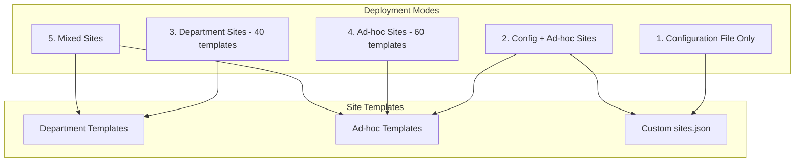

### Site Template Types

| Template | Code | Description | Use Case |
|----------|------|-------------|----------|
| Team Site - No Group | `STS#3` | Simple document storage | Basic collaboration |
| Team Site - With Group | `GROUP#0` | Full M365 Group integration | Teams integration |
| Communication Site | `SITEPAGEPUBLISHING#0` | News and announcements | Company communications |

---

## 🏷️ Deployment Tracking

### Tracking Architecture

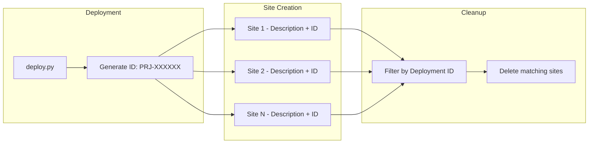

### Configuration

```json
{
  "deployment_tracking": {
    "enabled": true,
    "deployment_id": "",
    "append_to_description": true,
    "description_format": " | Ref: {id}"
  }
}
```

---

## 🚫 Exclusions System

The exclusions system provides whitelist/blacklist filtering for Azure AD users. This applies to:
- **Site Owner/Member Assignment** - When assigning random Azure AD users as site owners or members
- **File Population** - When using Azure AD user names in file and folder names

### Exclusion Architecture

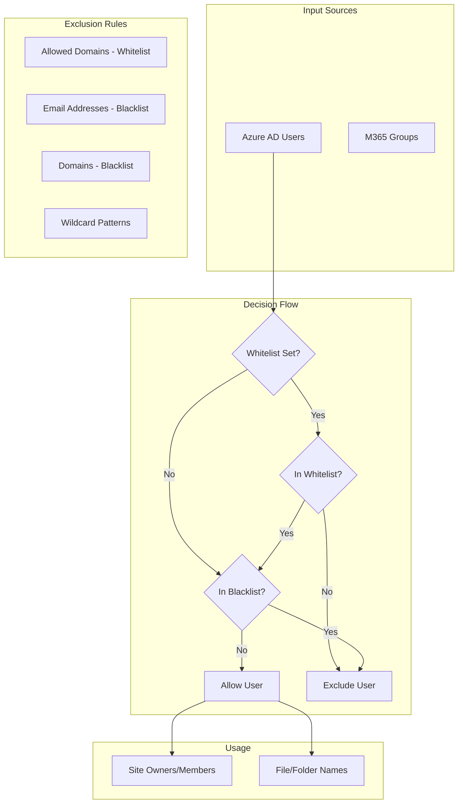

### Exclusion Functions

| Function | Location | Purpose |
|----------|----------|---------|
| [`load_exclusions_config()`](../scripts/populate_files.py:144) | populate_files.py | Load exclusions from sites.json |
| [`is_user_excluded()`](../scripts/populate_files.py:165) | populate_files.py | Check if user matches exclusion rules |
| [`filter_users_by_exclusions()`](../scripts/populate_files.py:232) | populate_files.py | Filter user list and log summary |

### Configuration Example

```json
{
  "exclusions": {
    "enabled": true,
    
    "_allowed_domains_comment": "WHITELIST: Only use users from these domains (takes precedence)",
    "allowed_domains": ["customdomain.com", "company.onmicrosoft.com"],
    
    "_email_addresses_comment": "BLACKLIST: Specific email addresses to exclude",
    "email_addresses": ["admin@contoso.com", "service@contoso.com"],
    
    "_domains_comment": "BLACKLIST: Entire domains to exclude",
    "domains": ["external.com", "contractor.com"],
    
    "_patterns_comment": "BLACKLIST: Wildcard patterns (supports * for any characters)",
    "patterns": ["admin*@*", "*-external@*", "test-*@*"],
    
    "log_exclusions": true
  }
}
```

### Exclusion Priority

1. **Whitelist Check** - If `allowed_domains` is set, user must be from one of those domains
2. **Email Blacklist** - Check against specific `email_addresses`
3. **Domain Blacklist** - Check against `domains` list
4. **Pattern Blacklist** - Check against wildcard `patterns`

### Use Cases

| Scenario | Configuration |
|----------|---------------|
| Only use company users | `"allowed_domains": ["company.com"]` |
| Exclude admin accounts | `"patterns": ["admin*@*"]` |
| Exclude external contractors | `"domains": ["contractor.com"]` |
| Exclude specific person | `"email_addresses": ["john.doe@company.com"]` |

---

## 🗑️ Cleanup Architecture

### Multi-Stage Deletion

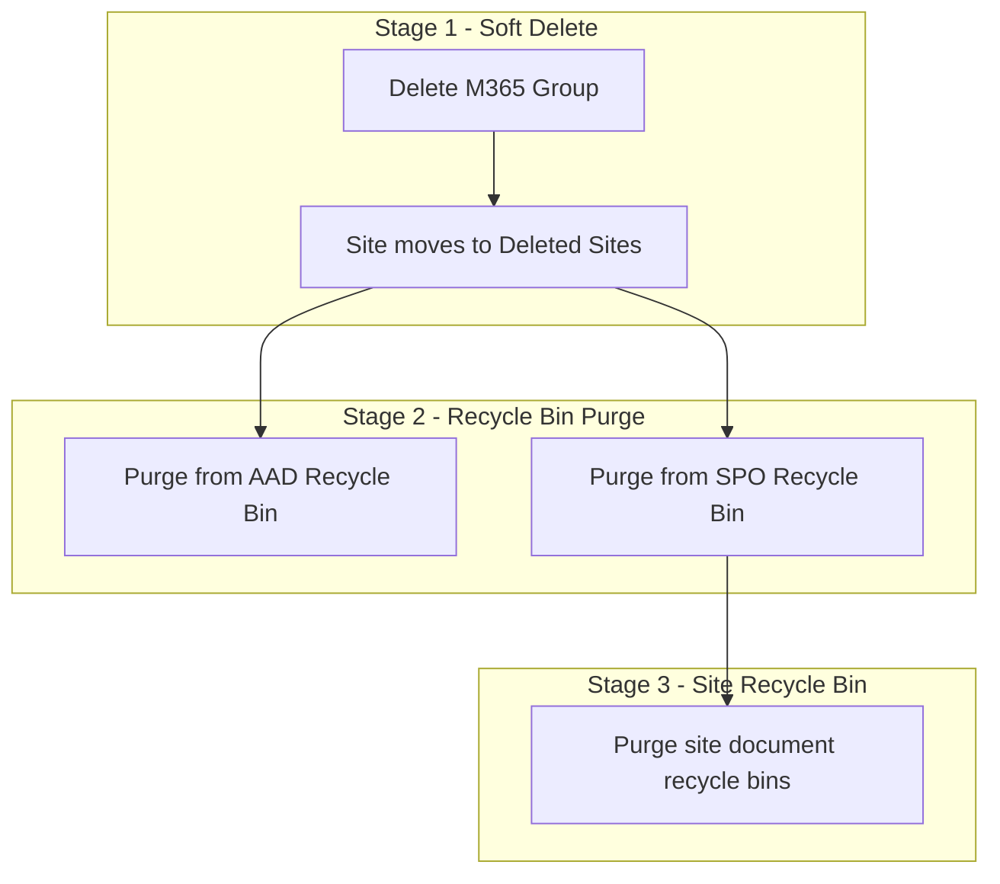

### Cleanup Commands

| Command | Purpose |
|---------|---------|
| `--delete-files` | Delete all files from sites |
| `--delete-sites` | Delete SharePoint sites |
| `--purge-deleted` | Purge M365 Groups recycle bin |
| `--purge-spo-recycle` | Purge SharePoint site recycle bin |
| `--purge-site-recycle` | Purge site document library recycle bins |

---

## 📄 File Population Architecture

### Document Generation

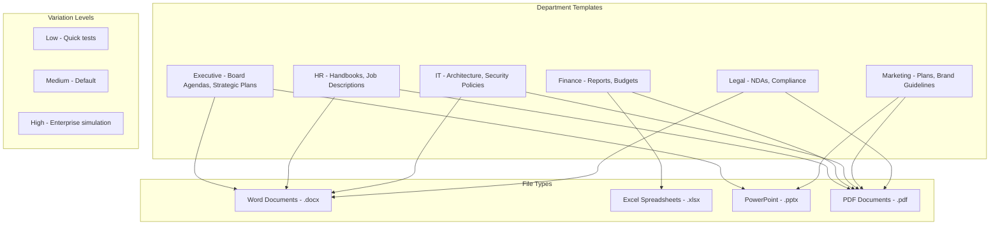

### Upload Process

1. **Site Discovery** - List available SharePoint sites via Graph API
2. **Site Filtering** - Exclude system sites that cause 403 errors
3. **User Discovery** - Discover Azure AD users for file naming (optional)
4. **User Filtering** - Apply whitelist/blacklist exclusions from `sites.json`
5. **Document Generation** - Create department-appropriate files with user names
6. **Upload** - Upload to site document libraries via Graph API
7. **Verification** - Confirm successful upload

### File Naming with Azure AD Users

When using Azure AD modes, files and folders can include user names:

| File Type | Example |
|-----------|---------|
| Personal Document | `John Smith - Meeting Notes 2024-03-15.docx` |
| Expense Report | `Jane Doe - Expense Report March_2024.xlsx` |
| Shared Document | `Shared by John Smith - Budget Document.docx` |
| User Folder | `John Smith/` |

**Important:** The exclusions configuration in `sites.json` filters which users can appear in file/folder names. This prevents admin accounts, service accounts, or specific domains from being used.

---

## 🔄 Error Handling & Recovery

### Common Error Scenarios

| Error | Cause | Recovery |
|-------|-------|----------|
| 403 Forbidden | Missing permissions | Grant admin consent via App Registration |
| Site Already Exists | Duplicate deployment | Use existing resource group option |
| Rate Limited (429) | Too many API calls | Automatic retry with exponential backoff |
| Terraform State Lock | Concurrent execution | Force unlock or wait |
| Key Vault Name Taken | Global uniqueness | Specify custom name or disable |

### Retry Strategy

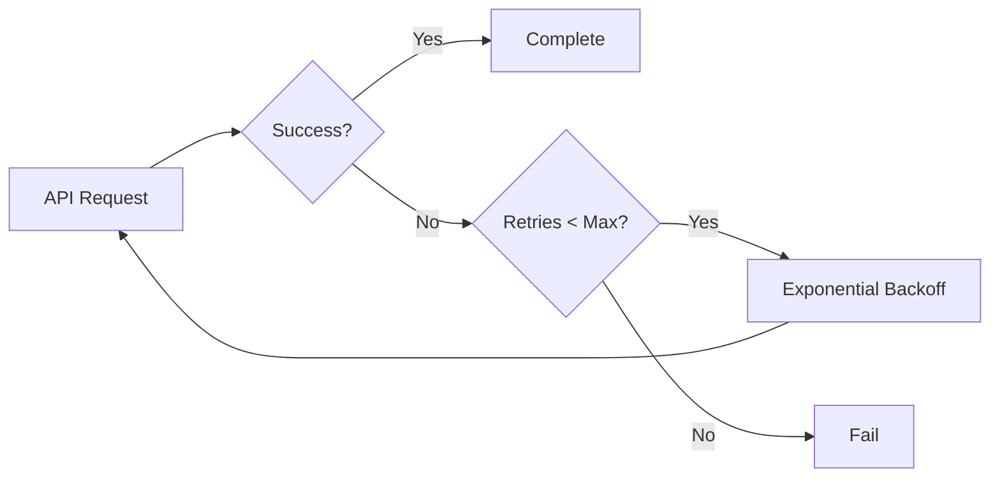

---

## 🛡️ Security Considerations

### Security Best Practices

1. **Never commit `terraform.tfvars`** - Contains sensitive tenant information
2. **Never commit `config/` files with real data** - May contain emails and tenant info
3. **Use Azure Key Vault** - Store secrets securely in production
4. **Review before applying** - Always check Terraform plan output
5. **Use exclusions** - Protect admin and service accounts from random assignment
6. **Rotate client secrets** - Regenerate app secrets periodically

### Sensitive Data Handling

| Data Type | Storage | Protection |
|-----------|---------|------------|
| Tenant ID | terraform.tfvars | .gitignore |
| Client Secret | .app_config.json | .gitignore |
| Site URLs | Azure Key Vault | RBAC |
| User Emails | config/sites.json | .gitignore |

---

## 📊 Monitoring & Logging

### Terraform Logging

```bash
# Enable debug logging
export TF_LOG=DEBUG
export TF_LOG_PATH=./terraform-debug.log
terraform plan
```

### Script Logging

- Progress indicators for long operations
- Color-coded status messages (✓ success, ✗ error, ⚠ warning)
- Summary statistics after operations

---

## 🔗 Integration Points

### External Dependencies

| Dependency | Version | Purpose |
|------------|---------|---------|
| Python | 3.8+ | Script execution |
| Azure CLI | 2.50.0+ | Azure authentication |
| Terraform | 1.5.0+ | Infrastructure orchestration |
| PowerShell | 5.1+ | Site creation scripts |
| PnP.PowerShell | Latest | SharePoint administration |

### API Endpoints

| API | Endpoint | Purpose |
|-----|----------|---------|
| Microsoft Graph | `https://graph.microsoft.com/v1.0` | Site and file operations |
| Azure Resource Manager | `https://management.azure.com` | Azure resource management |
| SharePoint Admin | `https://{tenant}-admin.sharepoint.com` | Site administration |

---

## 📚 Related Documentation

| Document | Description |
|----------|-------------|
| [README.md](../README.md) | Main project documentation |
| [CONFIGURATION-GUIDE.md](../CONFIGURATION-GUIDE.md) | Configuration instructions |
| [PREREQUISITES.md](../PREREQUISITES.md) | Setup requirements |
| [TROUBLESHOOTING.md](../docs/TROUBLESHOOTING.md) | Common issues and solutions |
| [EMAIL_POPULATION.md](../docs/EMAIL_POPULATION.md) | Email population guide |

---

## 📝 Version History

| Version | Date | Changes |
|---------|------|---------|
| 1.0 | 2024 | Initial architecture documentation |
