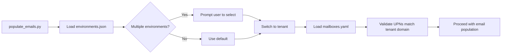

# M365 Email Population Tool - Implementation Plan

## Table of Contents
1. [Configuration Schema](#1-configuration-schema)
2. [Email Content Templates](#2-email-content-templates)
3. [Code Architecture](#3-code-architecture)
4. [Implementation Checklist](#4-implementation-checklist)
5. [API Permissions Setup](#5-api-permissions-setup)

---

## 1. Configuration Schema

### 1.0 Environment/Tenant Configuration (environments.json)

The email population tool will **reuse the existing `environments.json`** configuration file for tenant connection details. This ensures consistency across all tools in the SharePoint Sites Terraform project.

**Location:** `sharepoint-sites-terraform/config/environments.json`

```json
{
  "environments": [
    {
      "name": "Default",
      "description": "My organization's Azure environment",
      
      "azure": {
        "tenant_id": "12345678-1234-1234-1234-123456789abc",
        "tenant_name": "Contoso",
        "subscription_id": "87654321-4321-4321-4321-cba987654321",
        "subscription_name": "Production",
        "resource_group": "rg-sharepoint-sites",
        "location": "westeurope"
      },
      
      "m365": {
        "tenant_name": "contoso",
        "admin_email": "admin@contoso.onmicrosoft.com"
      }
    }
  ],

  "default_environment": "Default"
}
```

**How the Email Tool Uses This:**
1. **Auto-detect tenant**: Reads `tenant_id` from the selected environment
2. **Auto-switch tenant**: Uses Azure CLI to switch to the correct tenant if needed
3. **Domain resolution**: Uses `m365.tenant_name` to construct email domains (e.g., `@contoso.onmicrosoft.com`)
4. **Multi-environment support**: If multiple environments exist, prompts user to select one

**Integration Flow:**


---

### 1.1 Mailboxes Configuration (mailboxes.yaml)

```yaml
# =============================================================================
# M365 Email Population - Mailboxes Configuration
# =============================================================================
# This file defines the mailboxes to populate with realistic emails.
# Place this file in: sharepoint-sites-terraform/config/mailboxes.yaml
# =============================================================================

# Global settings for email population
settings:
  # Default number of emails per mailbox (can be overridden per user)
  default_email_count: 50
  
  # Date range for backdating emails (in months)
  date_range_months: 12
  
  # Include Microsoft 365 sensitivity labels
  include_sensitivity_labels: true
  
  # Email type distribution (must sum to 100)
  email_distribution:
    newsletters: 20
    links: 20
    attachments: 20
    organisational: 20
    interdepartmental: 20
  
  # Threading settings
  threading:
    enabled: true
    single_email_percentage: 60
    reply_chain_percentage: 25
    forward_chain_percentage: 10
    reply_all_percentage: 5
    max_thread_depth: 5
  
  # Sender distribution
  sender_distribution:
    internal_users: 60
    internal_system: 20
    external: 20
  
  # Date distribution settings
  date_settings:
    business_hours_percentage: 85
    weekday_percentage: 90
    recent_bias: true  # More emails in recent months

# =============================================================================
# User Definitions
# =============================================================================
# Each user requires:
#   - upn: User Principal Name (email address)
#   - role: Job title
# Optional:
#   - department: Department name (auto-mapped if not specified)
#   - email_volume: high/medium/low or specific number
#   - receives_from: List of departments this user receives emails from
# =============================================================================

users:
  # Executive Leadership
  - upn: hemal.desai@adaptgbmgthdfeb26.onmicrosoft.com
    role: CEO
    department: Executive Leadership
    email_volume: high
    receives_from:
      - Executive Leadership
      - Finance Department
      - Human Resources
      - IT Department
      - All Departments  # Company-wide announcements
    
  - upn: ashley.kingscote@adaptgbmgthdfeb26.onmicrosoft.com
    role: Head of IT
    department: IT Department
    email_volume: high
    receives_from:
      - IT Department
      - Executive Leadership
      - All Departments
      - External Vendors

  # Add more users following the same pattern...
  # Example additional users:
  
  # - upn: sarah.johnson@adaptgbmgthdfeb26.onmicrosoft.com
  #   role: HR Manager
  #   department: Human Resources
  #   email_volume: medium
  #   receives_from:
  #     - Human Resources
  #     - Executive Leadership
  #     - All Departments
  
  # - upn: michael.chen@adaptgbmgthdfeb26.onmicrosoft.com
  #   role: Finance Director
  #   department: Finance Department
  #   email_volume: high

# =============================================================================
# Department Configuration
# =============================================================================
# Maps departments to SharePoint sites and defines internal senders
# =============================================================================

departments:
  Executive Leadership:
    sharepoint_site: executive-leadership
    system_email: executive-office@{domain}
    internal_senders:
      - role: CEO
        display_name: "{first_name} {last_name}"
      - role: CFO
        display_name: "{first_name} {last_name}"
      - role: COO
        display_name: "{first_name} {last_name}"
    
  IT Department:
    sharepoint_site: it-department
    system_email: it-support@{domain}
    internal_senders:
      - role: Head of IT
        display_name: "{first_name} {last_name}"
      - role: IT Manager
        display_name: "{first_name} {last_name}"
      - role: System Administrator
        display_name: "{first_name} {last_name}"
    
  Human Resources:
    sharepoint_site: human-resources
    system_email: hr@{domain}
    internal_senders:
      - role: HR Director
        display_name: "{first_name} {last_name}"
      - role: HR Manager
        display_name: "{first_name} {last_name}"
      - role: Recruitment Specialist
        display_name: "{first_name} {last_name}"
    
  Finance Department:
    sharepoint_site: finance-department
    system_email: finance@{domain}
    internal_senders:
      - role: Finance Director
        display_name: "{first_name} {last_name}"
      - role: Financial Controller
        display_name: "{first_name} {last_name}"
      - role: Accounts Manager
        display_name: "{first_name} {last_name}"
    
  Marketing Department:
    sharepoint_site: marketing-department
    system_email: marketing@{domain}
    internal_senders:
      - role: Marketing Director
        display_name: "{first_name} {last_name}"
      - role: Marketing Manager
        display_name: "{first_name} {last_name}"
    
  Sales Department:
    sharepoint_site: sales-department
    system_email: sales@{domain}
    internal_senders:
      - role: Sales Director
        display_name: "{first_name} {last_name}"
      - role: Sales Manager
        display_name: "{first_name} {last_name}"
    
  Legal & Compliance:
    sharepoint_site: legal-compliance
    system_email: legal@{domain}
    internal_senders:
      - role: General Counsel
        display_name: "{first_name} {last_name}"
      - role: Compliance Officer
        display_name: "{first_name} {last_name}"
    
  Operations Department:
    sharepoint_site: operations-department
    system_email: operations@{domain}
    internal_senders:
      - role: Operations Director
        display_name: "{first_name} {last_name}"
      - role: Operations Manager
        display_name: "{first_name} {last_name}"
    
  Customer Service:
    sharepoint_site: customer-service
    system_email: support@{domain}
    internal_senders:
      - role: Customer Service Manager
        display_name: "{first_name} {last_name}"

# =============================================================================
# External Senders Configuration
# =============================================================================
# Defines external email sources for newsletters and vendor communications
# =============================================================================

external_senders:
  newsletters:
    - name: "Tech Industry Weekly"
      email: newsletter@techindustryweekly.com
      type: industry_news
      
    - name: "HR Insights"
      email: updates@hrinsights.com
      type: hr_newsletter
      
    - name: "Financial Times"
      email: newsletters@ft.com
      type: finance_news
      
    - name: "Microsoft 365 Updates"
      email: no-reply@microsoft.com
      type: product_updates
      
    - name: "LinkedIn"
      email: messages-noreply@linkedin.com
      type: social_professional
      
  vendors:
    - name: "Acme Software Solutions"
      email: support@acmesoftware.com
      type: vendor_support
      
    - name: "CloudFirst Services"
      email: accounts@cloudfirst.io
      type: vendor_billing
      
    - name: "SecureIT Partners"
      email: alerts@secureitpartners.com
      type: security_vendor

# =============================================================================
# Sensitivity Labels
# =============================================================================
# Microsoft 365 sensitivity label configuration
# =============================================================================

sensitivity_labels:
  general:
    name: "General"
    percentage: 50
    applies_to:
      - newsletters
      - links
      
  internal:
    name: "Internal"
    percentage: 30
    applies_to:
      - organisational
      - interdepartmental
      
  confidential:
    name: "Confidential"
    percentage: 15
    applies_to:
      - attachments
    departments:
      - Human Resources
      - Finance Department
      - Legal & Compliance
      
  highly_confidential:
    name: "Highly Confidential"
    percentage: 5
    applies_to:
      - attachments
    departments:
      - Executive Leadership

# =============================================================================
# Email Volume Mappings
# =============================================================================

volume_mappings:
  high: 100
  medium: 50
  low: 25
```

---

## 2. Email Content Templates

### 2.1 Template Structure

Each email template includes:
- Subject line with placeholders
- HTML body with styling
- Plain text alternative
- Metadata (category, sensitivity, attachment requirements)

### 2.2 Newsletter Templates

#### Company Newsletter Template
```python
COMPANY_NEWSLETTER = {
    "category": "newsletter",
    "sensitivity": "general",
    "subject_templates": [
        "{company_name} Weekly Update - Week {week_number}",
        "{company_name} Monthly Newsletter - {month} {year}",
        "📢 Company News & Updates - {date}",
        "This Week at {company_name}",
    ],
    "body_template": """
<!DOCTYPE html>
<html>
<head>
    <style>
        body { font-family: 'Segoe UI', Arial, sans-serif; line-height: 1.6; color: #333; }
        .header { background: linear-gradient(135deg, #0078d4, #00bcf2); color: white; padding: 30px; text-align: center; }
        .content { padding: 30px; max-width: 600px; margin: 0 auto; }
        .section { margin-bottom: 25px; }
        .section-title { color: #0078d4; border-bottom: 2px solid #0078d4; padding-bottom: 5px; }
        .highlight-box { background: #f3f2f1; padding: 15px; border-left: 4px solid #0078d4; margin: 15px 0; }
        .footer { background: #f3f2f1; padding: 20px; text-align: center; font-size: 12px; color: #666; }
        a { color: #0078d4; }
    </style>
</head>
<body>
    <div class="header">
        <h1>📰 {company_name} Newsletter</h1>
        <p>{date}</p>
    </div>
    
    <div class="content">
        <p>Dear {recipient_first_name},</p>
        
        <p>Welcome to this week's company newsletter! Here's what's happening across the organisation.</p>
        
        <div class="section">
            <h2 class="section-title">📢 Company News</h2>
            {company_news}
        </div>
        
        <div class="section">
            <h2 class="section-title">📅 Upcoming Events</h2>
            {upcoming_events}
        </div>
        
        <div class="section">
            <h2 class="section-title">🏆 Employee Spotlight</h2>
            {employee_spotlight}
        </div>
        
        <div class="highlight-box">
            <strong>💡 Did You Know?</strong><br>
            {fun_fact}
        </div>
        
        <div class="section">
            <h2 class="section-title">📊 Department Updates</h2>
            {department_updates}
        </div>
        
        <p>Have news to share? Contact <a href="mailto:communications@{domain}">Corporate Communications</a>.</p>
        
        <p>Best regards,<br>
        <strong>Corporate Communications Team</strong></p>
    </div>
    
    <div class="footer">
        <p>{company_name} | Internal Communications</p>
        <p>This email is intended for internal use only.</p>
    </div>
</body>
</html>
""",
    "content_generators": {
        "company_news": "generate_company_news",
        "upcoming_events": "generate_upcoming_events",
        "employee_spotlight": "generate_employee_spotlight",
        "fun_fact": "generate_fun_fact",
        "department_updates": "generate_department_updates",
    }
}
```

#### Industry Newsletter Template
```python
INDUSTRY_NEWSLETTER = {
    "category": "newsletter",
    "sensitivity": "general",
    "sender_type": "external",
    "subject_templates": [
        "{industry} Weekly Digest - {date}",
        "Your {industry} News Roundup",
        "📈 {industry} Insights - {month} {year}",
        "Top {industry} Stories This Week",
    ],
    "body_template": """
<!DOCTYPE html>
<html>
<head>
    <style>
        body { font-family: Arial, sans-serif; line-height: 1.6; color: #333; background: #f5f5f5; }
        .container { max-width: 600px; margin: 0 auto; background: white; }
        .header { background: #1a1a2e; color: white; padding: 25px; text-align: center; }
        .content { padding: 25px; }
        .article { border-bottom: 1px solid #eee; padding: 15px 0; }
        .article:last-child { border-bottom: none; }
        .article-title { color: #1a1a2e; font-size: 18px; margin-bottom: 8px; }
        .article-meta { color: #666; font-size: 12px; margin-bottom: 10px; }
        .read-more { color: #0066cc; text-decoration: none; font-weight: bold; }
        .footer { background: #f5f5f5; padding: 20px; text-align: center; font-size: 11px; color: #666; }
    </style>
</head>
<body>
    <div class="container">
        <div class="header">
            <h1>{newsletter_name}</h1>
            <p>{tagline}</p>
        </div>
        
        <div class="content">
            <p>Hi {recipient_first_name},</p>
            <p>Here's your weekly roundup of the latest {industry} news and insights.</p>
            
            {articles}
            
            <p style="margin-top: 25px;">Stay informed,<br>
            <strong>The {newsletter_name} Team</strong></p>
        </div>
        
        <div class="footer">
            <p>You're receiving this because you subscribed to {newsletter_name}.</p>
            <p><a href="#">Unsubscribe</a> | <a href="#">Manage Preferences</a> | <a href="#">View Online</a></p>
        </div>
    </div>
</body>
</html>
"""
}
```

### 2.3 SharePoint Link Templates

```python
SHAREPOINT_DOCUMENT_NOTIFICATION = {
    "category": "links",
    "sensitivity": "internal",
    "subject_templates": [
        "New Document: {document_name}",
        "📄 Document Shared: {document_name}",
        "Please Review: {document_name} on {site_name}",
        "Updated: {document_name} - Action Required",
        "{sender_name} shared a document with you",
    ],
    "body_template": """
<!DOCTYPE html>
<html>
<head>
    <style>
        body { font-family: 'Segoe UI', Arial, sans-serif; line-height: 1.6; color: #333; }
        .container { max-width: 600px; margin: 0 auto; padding: 20px; }
        .document-card { background: #f3f2f1; border-radius: 8px; padding: 20px; margin: 20px 0; }
        .document-icon { font-size: 48px; margin-bottom: 10px; }
        .document-name { font-size: 18px; font-weight: bold; color: #0078d4; }
        .document-meta { color: #666; font-size: 14px; margin: 10px 0; }
        .btn { display: inline-block; background: #0078d4; color: white; padding: 12px 24px; 
               text-decoration: none; border-radius: 4px; margin-top: 15px; }
        .btn:hover { background: #106ebe; }
        .footer { margin-top: 30px; padding-top: 20px; border-top: 1px solid #eee; font-size: 12px; color: #666; }
    </style>
</head>
<body>
    <div class="container">
        <p>Hi {recipient_first_name},</p>
        
        <p>{sender_name} has shared a document with you from the <strong>{site_name}</strong> SharePoint site.</p>
        
        <div class="document-card">
            <div class="document-icon">{document_icon}</div>
            <div class="document-name">{document_name}</div>
            <div class="document-meta">
                📁 Location: {site_name} / {folder_path}<br>
                👤 Shared by: {sender_name}<br>
                📅 Date: {share_date}<br>
                📊 Size: {file_size}
            </div>
            <a href="{sharepoint_url}" class="btn">Open Document</a>
        </div>
        
        <p><strong>Message from {sender_first_name}:</strong></p>
        <blockquote style="border-left: 3px solid #0078d4; padding-left: 15px; color: #555;">
            {personal_message}
        </blockquote>
        
        {action_required}
        
        <p>Best regards,<br>
        {sender_name}<br>
        <span style="color: #666;">{sender_title} | {sender_department}</span></p>
        
        <div class="footer">
            <p>This is an automated notification from SharePoint.</p>
            <p><a href="{site_url}">Visit {site_name}</a> | <a href="#">Notification Settings</a></p>
        </div>
    </div>
</body>
</html>
"""
}
```

### 2.4 Attachment Email Templates

```python
REPORT_WITH_ATTACHMENT = {
    "category": "attachments",
    "sensitivity": "confidential",
    "has_attachment": True,
    "subject_templates": [
        "{report_type} Report - {period}",
        "📊 {report_type} for Your Review",
        "{department} {report_type} - {date}",
        "Attached: {document_name}",
        "Q{quarter} {report_type} - Please Review",
    ],
    "body_template": """
<!DOCTYPE html>
<html>
<head>
    <style>
        body { font-family: 'Segoe UI', Arial, sans-serif; line-height: 1.6; color: #333; }
        .container { max-width: 600px; margin: 0 auto; padding: 20px; }
        .attachment-box { background: #fff4ce; border: 1px solid #ffc107; border-radius: 8px; 
                          padding: 15px; margin: 20px 0; display: flex; align-items: center; }
        .attachment-icon { font-size: 36px; margin-right: 15px; }
        .attachment-info { flex: 1; }
        .attachment-name { font-weight: bold; color: #333; }
        .attachment-size { color: #666; font-size: 12px; }
        .key-points { background: #f3f2f1; padding: 15px; border-radius: 8px; margin: 20px 0; }
        .key-points ul { margin: 10px 0; padding-left: 20px; }
        .deadline { background: #fde7e9; border-left: 4px solid #d13438; padding: 10px 15px; margin: 20px 0; }
        .signature { margin-top: 30px; padding-top: 20px; border-top: 1px solid #eee; }
    </style>
</head>
<body>
    <div class="container">
        <p>Dear {recipient_name},</p>
        
        <p>Please find attached the <strong>{report_type}</strong> for {period}.</p>
        
        <div class="attachment-box">
            <div class="attachment-icon">{file_icon}</div>
            <div class="attachment-info">
                <div class="attachment-name">📎 {attachment_name}</div>
                <div class="attachment-size">{file_type} • {file_size}</div>
            </div>
        </div>
        
        <div class="key-points">
            <strong>📋 Key Highlights:</strong>
            <ul>
                {key_points}
            </ul>
        </div>
        
        {executive_summary}
        
        <div class="deadline">
            <strong>⏰ Review Deadline:</strong> {deadline}<br>
            <span style="font-size: 13px;">Please provide your feedback by this date.</span>
        </div>
        
        <p>If you have any questions or need clarification on any items, please don't hesitate to reach out.</p>
        
        <div class="signature">
            <p>Best regards,</p>
            <p><strong>{sender_name}</strong><br>
            {sender_title}<br>
            {sender_department}</p>
            <p style="font-size: 12px; color: #666;">
                📞 {sender_phone}<br>
                ✉️ {sender_email}
            </p>
        </div>
    </div>
</body>
</html>
""",
    "attachment_types": ["xlsx", "pdf", "docx", "pptx"]
}
```

### 2.5 Organisational Communication Templates

```python
COMPANY_ANNOUNCEMENT = {
    "category": "organisational",
    "sensitivity": "internal",
    "subject_templates": [
        "📢 Important Announcement: {announcement_title}",
        "Company Update: {announcement_title}",
        "All Staff: {announcement_title}",
        "Message from {sender_role}: {announcement_title}",
        "🔔 {announcement_type}: {announcement_title}",
    ],
    "body_template": """
<!DOCTYPE html>
<html>
<head>
    <style>
        body { font-family: 'Segoe UI', Arial, sans-serif; line-height: 1.6; color: #333; }
        .container { max-width: 600px; margin: 0 auto; }
        .banner { background: linear-gradient(135deg, #0078d4, #00bcf2); color: white; 
                  padding: 30px; text-align: center; }
        .banner h1 { margin: 0; font-size: 24px; }
        .banner .type { opacity: 0.9; font-size: 14px; margin-top: 5px; }
        .content { padding: 30px; }
        .highlight { background: #e6f3ff; border-left: 4px solid #0078d4; padding: 15px; margin: 20px 0; }
        .action-items { background: #f3f2f1; padding: 20px; border-radius: 8px; margin: 20px 0; }
        .effective-date { background: #dff6dd; border: 1px solid #107c10; padding: 15px; 
                          border-radius: 8px; margin: 20px 0; text-align: center; }
        .contact-box { background: #f3f2f1; padding: 15px; border-radius: 8px; margin: 20px 0; }
        .footer { padding: 20px; background: #f3f2f1; text-align: center; font-size: 12px; }
        .sensitivity-label { display: inline-block; background: #ffc107; color: #333; 
                             padding: 3px 10px; border-radius: 3px; font-size: 11px; font-weight: bold; }
    </style>
</head>
<body>
    <div class="container">
        <div class="banner">
            <div class="type">{announcement_type}</div>
            <h1>{announcement_title}</h1>
        </div>
        
        <div class="content">
            <p>Dear Colleagues,</p>
            
            <p>{greeting}</p>
            
            <div class="highlight">
                {main_announcement}
            </div>
            
            {details}
            
            <div class="action-items">
                <strong>📋 What This Means For You:</strong>
                <ul>
                    {action_items}
                </ul>
            </div>
            
            <div class="effective-date">
                <strong>📅 Effective Date:</strong> {effective_date}
            </div>
            
            <div class="contact-box">
                <strong>❓ Questions?</strong><br>
                {contact_info}
            </div>
            
            <p>Thank you for your attention to this matter.</p>
            
            <p>Best regards,</p>
            <p><strong>{sender_name}</strong><br>
            {sender_title}</p>
        </div>
        
        <div class="footer">
            <span class="sensitivity-label">SENSITIVITY: {sensitivity_label}</span>
            <p style="margin-top: 10px;">{company_name} | Internal Communication</p>
        </div>
    </div>
</body>
</html>
"""
}

HR_POLICY_UPDATE = {
    "category": "organisational",
    "sensitivity": "internal",
    "department": "Human Resources",
    "subject_templates": [
        "HR Policy Update: {policy_name}",
        "📋 Updated Policy: {policy_name}",
        "Important: Changes to {policy_name}",
        "HR Notice: {policy_name} - Effective {date}",
    ],
    # Similar body template structure...
}
```

### 2.6 Inter-departmental Email Templates

```python
PROJECT_UPDATE = {
    "category": "interdepartmental",
    "sensitivity": "internal",
    "supports_threading": True,
    "subject_templates": [
        "Re: {project_name} - Status Update",
        "{project_name} - Weekly Progress",
        "Update: {project_name} - {milestone}",
        "Re: {project_name} Discussion",
    ],
    "body_template": """
<!DOCTYPE html>
<html>
<head>
    <style>
        body { font-family: 'Segoe UI', Arial, sans-serif; line-height: 1.6; color: #333; }
        .container { max-width: 600px; margin: 0 auto; padding: 20px; }
        .status-section { margin: 20px 0; }
        .status-header { font-weight: bold; margin-bottom: 10px; }
        .completed { color: #107c10; }
        .in-progress { color: #0078d4; }
        .upcoming { color: #8764b8; }
        .status-item { padding: 5px 0; padding-left: 20px; position: relative; }
        .status-item::before { content: ''; position: absolute; left: 0; top: 10px; 
                               width: 8px; height: 8px; border-radius: 50%; }
        .completed .status-item::before { background: #107c10; }
        .in-progress .status-item::before { background: #0078d4; }
        .upcoming .status-item::before { background: #8764b8; }
        .next-steps { background: #f3f2f1; padding: 15px; border-radius: 8px; margin: 20px 0; }
        .quoted-email { border-left: 3px solid #ccc; padding-left: 15px; margin: 20px 0; 
                        color: #666; font-size: 13px; }
    </style>
</head>
<body>
    <div class="container">
        <p>Hi {recipient_first_name},</p>
        
        <p>{context_message}</p>
        
        <p>Here's the latest update on <strong>{project_name}</strong>:</p>
        
        <div class="status-section completed">
            <div class="status-header">✅ Completed</div>
            {completed_items}
        </div>
        
        <div class="status-section in-progress">
            <div class="status-header">🔄 In Progress</div>
            {in_progress_items}
        </div>
        
        <div class="status-section upcoming">
            <div class="status-header">⏳ Upcoming</div>
            {upcoming_items}
        </div>
        
        <div class="next-steps">
            <strong>📋 Next Steps:</strong>
            <ol>
                {next_steps}
            </ol>
        </div>
        
        <p>Let me know if you have any questions or need additional information.</p>
        
        <p>Cheers,<br>
        {sender_first_name}</p>
        
        {quoted_thread}
    </div>
</body>
</html>
""",
    "thread_template": """
        <div class="quoted-email">
            <p><strong>On {previous_date}, {previous_sender} wrote:</strong></p>
            {previous_content}
        </div>
    """
}

MEETING_REQUEST = {
    "category": "interdepartmental",
    "sensitivity": "general",
    "subject_templates": [
        "Meeting Request: {meeting_topic}",
        "Can we schedule a call about {meeting_topic}?",
        "📅 {meeting_topic} - Meeting Invite",
        "Quick sync on {meeting_topic}?",
    ],
    # Body template...
}
```

---

## 3. Code Architecture

### 3.1 File Structure

```
sharepoint-sites-terraform/
├── config/
│   ├── sites.json                    # Existing
│   ├── mailboxes.yaml                # NEW: Mailbox configuration
│   └── environments.json             # Existing
│
├── scripts/
│   ├── menu.py                       # UPDATED: Add email population option
│   ├── populate_files.py             # Existing
│   ├── populate_emails.py            # NEW: Main email population script
│   ├── cleanup.py                    # Existing
│   │
│   └── email_generator/              # NEW: Email generation package
│       ├── __init__.py
│       ├── config.py                 # Configuration loader
│       ├── templates.py              # Email templates
│       ├── content_generator.py      # Dynamic content generation
│       ├── attachments.py            # Attachment file generation
│       ├── threading.py              # Email thread management
│       ├── graph_client.py           # Microsoft Graph API client
│       └── utils.py                  # Utility functions
│
├── templates/                        # NEW: Email template files
│   └── emails/
│       ├── newsletters/
│       ├── sharepoint/
│       ├── attachments/
│       ├── organisational/
│       └── interdepartmental/
│
└── docs/
    └── EMAIL_POPULATION.md           # NEW: Email tool documentation
```

---

## 4. Implementation Checklist

### Phase 1: Foundation
- [ ] Integrate with existing `config/environments.json` for tenant configuration
- [ ] Implement tenant auto-detection and switching from environments.json
- [ ] Create `config/mailboxes.yaml` configuration file
- [ ] Create `email_generator/` package structure
- [ ] Implement `config.py` - YAML configuration loader
- [ ] Implement `utils.py` - Utility functions
- [ ] Add PyYAML to requirements.txt

### Phase 2: Core Email Generation
- [ ] Implement `templates.py` - Email template definitions
- [ ] Implement `content_generator.py` - Dynamic content generation
- [ ] Create HTML email templates
- [ ] Implement placeholder replacement system
- [ ] Add content generators for each email section

### Phase 3: Attachments & Threading
- [ ] Implement `attachments.py` - Attachment generation
- [ ] Integrate with existing file generation from populate_files.py
- [ ] Implement `threading.py` - Email thread management
- [ ] Add reply chain generation
- [ ] Add forward chain generation

### Phase 4: Graph API Integration
- [ ] Implement `graph_client.py` - Microsoft Graph API client
- [ ] Add authentication (client credentials + Azure CLI fallback)
- [ ] Implement email creation endpoint
- [ ] Implement attachment upload
- [ ] Add batch processing for efficiency
- [ ] Implement rate limiting compliance

### Phase 5: Main Script
- [ ] Create `populate_emails.py` main script
- [ ] Implement CLI argument parsing
- [ ] Add interactive mode
- [ ] Implement mailbox selection modes
- [ ] Add progress tracking and reporting
- [ ] Implement dry-run mode

### Phase 6: Menu Integration
- [ ] Update `menu.py` with email population option [6]
- [ ] Add sub-menu for email options
- [ ] Integrate authentication flow
- [ ] Add email-specific help documentation

### Phase 7: Testing & Documentation
- [ ] Create `docs/EMAIL_POPULATION.md` documentation
- [ ] Add example configurations
- [ ] Test with single mailbox
- [ ] Test with multiple mailboxes
- [ ] Test all email types
- [ ] Test threading functionality
- [ ] Test attachment generation

---

## 5. API Permissions Setup

### Required Microsoft Graph API Permissions

| Permission | Type | Description |
|------------|------|-------------|
| `Mail.ReadWrite` | Application | Read and write mail in all mailboxes |
| `User.Read.All` | Application | Read all users' profiles |

### App Registration Update

Add these permissions to the existing `SharePoint-Sites-Terraform-Tool` app registration:

```bash
# Using Azure CLI - Add Mail permissions
az ad app permission add \
    --id <app-id> \
    --api 00000003-0000-0000-c000-000000000000 \
    --api-permissions \
        e2a3a72e-5f79-4c64-b1b1-878b674786c9=Role

# Grant admin consent
az ad app permission admin-consent --id <app-id>
```

---

## 6. Usage Examples

### Interactive Mode
```bash
cd sharepoint-sites-terraform/scripts
python populate_emails.py
```

### Command Line Options
```bash
# Populate all configured mailboxes with default settings
python populate_emails.py --all

# Populate specific number of mailboxes
python populate_emails.py --count 10

# Populate specific mailboxes
python populate_emails.py --mailboxes "user1@domain.com,user2@domain.com"

# Specify emails per mailbox
python populate_emails.py --all --emails-per-mailbox 100

# Random email count per mailbox
python populate_emails.py --all --emails-min 20 --emails-max 100

# Filter by department
python populate_emails.py --department "IT Department"

# Dry run - preview without creating emails
python populate_emails.py --all --dry-run

# List configured mailboxes
python populate_emails.py --list-mailboxes
```

### Menu Integration
From the main menu (`menu.py`), select option **[6] 📧 Populate Mailboxes with Emails**

---

## 7. Sample Output

```
  ═══════════════════════════════════════════════════════════════
                    M365 EMAIL POPULATION
  ═══════════════════════════════════════════════════════════════

  This script populates M365 mailboxes with realistic emails
  to simulate an actual organisation's communication patterns.

  [Step 1] Load Configuration
  ─────────────────────────────────────────────────────────────
  ✓ Loaded 20 mailboxes from config/mailboxes.yaml
  ✓ Loaded 20 SharePoint sites from config/sites.json

  [Step 2] Check Azure Authentication
  ─────────────────────────────────────────────────────────────
  ✓ Azure CLI authenticated
  ✓ Graph API permissions verified

  [Step 3] Configure Email Generation
  ─────────────────────────────────────────────────────────────
  
  How many emails per mailbox? (default: 50)
  Enter number (1-500): 100

  Summary:
    - Mailboxes to populate: 20
    - Emails per mailbox: 100
    - Total emails: 2,000
    - Date range: Past 12 months

  Proceed? (y/n): y

  [Step 4] Generate and Create Emails
  ─────────────────────────────────────────────────────────────

  ℹ Processing mailbox: hemal.desai@adaptgbmgthdfeb26.onmicrosoft.com
  [████████████████████████████████] 100% - Newsletter: Company Update...
  ✓ Created 100 emails (98 success, 2 failed)

  ℹ Processing mailbox: ashley.kingscote@adaptgbmgthdfeb26.onmicrosoft.com
  [████████████████████████████████] 100% - Project Update: Q4 Review...
  ✓ Created 100 emails (100 success, 0 failed)

  ... (continues for all mailboxes)

  [Step 5] Summary
  ─────────────────────────────────────────────────────────────

  Email Population Complete!

    ✓ Successfully created: 1,985 emails
    ✗ Failed: 15 emails
    ⏱ Duration: 245.3 seconds
    📊 Rate: 8.1 emails/second

  Email Type Distribution:
    📰 Newsletters: 397 (20%)
    🔗 Links: 401 (20%)
    📎 Attachments: 389 (20%)
    📢 Organisational: 405 (20%)
    💬 Inter-departmental: 393 (20%)

  ✓ Emails have been created in your M365 mailboxes!
```

---

## 8. Next Steps

After plan approval, switch to **Code mode** to implement:

1. Create the `email_generator/` package
2. Implement the configuration loader
3. Build email templates and content generators
4. Implement Graph API client
5. Create the main `populate_emails.py` script
6. Update `menu.py` with the new option
7. Test and document