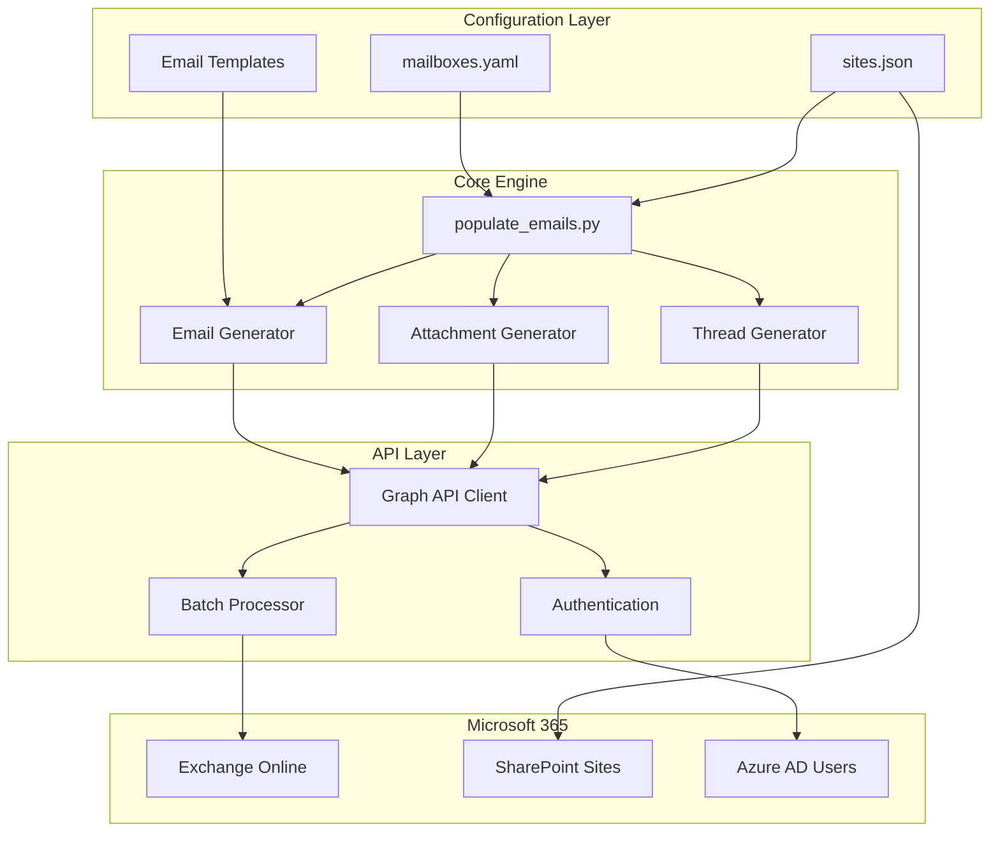

# M365 Email Population Tool - Requirements Specification

## Overview

This document outlines the requirements for a tool that automatically populates M365 email mailboxes with realistic organisational emails to simulate a real enterprise environment.

## Business Objectives

- Create a realistic email environment across 20+ M365 mailboxes
- Simulate authentic organisational communication patterns
- Support security testing, training, and demonstration scenarios
- Integrate with existing SharePoint sites infrastructure

---

## Functional Requirements

### 1. Mailbox Selection

#### 1.1 Configuration-Based Selection
- **YAML Configuration File**: Users define mailboxes in a `config/mailboxes.yaml` file
- **User Properties**:
  - `upn`: User Principal Name (email address)
  - `role`: Job title/role (e.g., CEO, Head of IT, HR Manager)
  - `department`: Department affiliation (optional, can be inferred from role)
  - `email_volume`: Override for number of emails (optional)

#### 1.2 Selection Modes
| Mode | Description |
|------|-------------|
| All Mailboxes | Populate all mailboxes defined in configuration |
| Count-Based | Populate a specified number of mailboxes (randomly selected) |
| Specific Selection | Populate only specified mailboxes by UPN or role |
| Department-Based | Populate mailboxes belonging to specific departments |

### 2. Email Volume Control

#### 2.1 Distribution Options
| Option | Description |
|--------|-------------|
| Fixed Per Mailbox | Same number of emails for each mailbox |
| Random Distribution | Random number within a specified range per mailbox |
| Role-Based | Volume based on role (executives get more, etc.) |
| Realistic Distribution | Weighted distribution mimicking real organisations |

#### 2.2 Volume Parameters
- Minimum emails per mailbox: 10
- Maximum emails per mailbox: 500
- Default: 50 emails per mailbox
- Total cap per run: 10,000 emails

### 3. Email Types and Categories

#### 3.1 Email Categories (Even Distribution)

```
┌─────────────────────────────────────────────────────────────────┐
│                    EMAIL TYPE DISTRIBUTION                       │
├─────────────────────────────────────────────────────────────────┤
│  Newsletter Emails (20%)                                         │
│  ├── Company newsletters                                         │
│  ├── Industry news digests                                       │
│  ├── Training announcements                                      │
│  └── External service newsletters                                │
├─────────────────────────────────────────────────────────────────┤
│  Emails with Links (20%)                                         │
│  ├── SharePoint document links                                   │
│  ├── Meeting invites with Teams links                            │
│  ├── External resource links                                     │
│  └── Intranet page links                                         │
├─────────────────────────────────────────────────────────────────┤
│  Emails with Attachments (20%)                                   │
│  ├── Reports (PDF, Excel)                                        │
│  ├── Presentations (PowerPoint)                                  │
│  ├── Documents (Word)                                            │
│  └── Department-specific files                                   │
├─────────────────────────────────────────────────────────────────┤
│  Organisational Communications (20%)                             │
│  ├── Policy updates                                              │
│  ├── Company announcements                                       │
│  ├── HR communications                                           │
│  └── Leadership messages                                         │
├─────────────────────────────────────────────────────────────────┤
│  Inter-departmental Emails (20%)                                 │
│  ├── Project updates                                             │
│  ├── Meeting requests                                            │
│  ├── Status reports                                              │
│  └── Collaboration requests                                      │
└─────────────────────────────────────────────────────────────────┘
```

### 4. Email Content Requirements

#### 4.1 Sender Types
| Sender Type | Percentage | Examples |
|-------------|------------|----------|
| Internal Users | 60% | Colleagues, managers, executives |
| Internal System | 20% | HR@company.com, IT-Support@company.com |
| External Senders | 20% | Newsletters, vendors, partners |

#### 4.2 Email Body Content
- **Realistic formatting**: HTML emails with proper styling
- **Department-relevant content**: Emails match the recipient's department
- **Variable content**: Templates with dynamic placeholders
- **Professional tone**: Business-appropriate language
- **Signatures**: Include realistic email signatures

#### 4.3 SharePoint Integration
- Links to actual SharePoint sites from `sites.json`
- References to documents in SharePoint libraries
- Notifications about SharePoint activity
- Example: "Please review the Q4 Budget Report on the Finance Department SharePoint site"

### 5. Email Threading

#### 5.1 Thread Types
| Type | Description | Percentage |
|------|-------------|------------|
| Single Email | Standalone email | 60% |
| Reply Chain | 2-5 emails in thread | 25% |
| Forward Chain | Forwarded with comments | 10% |
| Reply-All Chain | Multiple recipients | 5% |

#### 5.2 Thread Characteristics
- Realistic time gaps between replies (minutes to hours)
- Coherent conversation flow
- Appropriate participants based on topic

### 6. Date Distribution

#### 6.1 Backdating Strategy
- **Range**: Past 6-12 months
- **Distribution**: Weighted towards recent dates (more recent = more emails)
- **Business Hours**: Most emails during 8am-6pm
- **Weekday Bias**: 90% weekdays, 10% weekends
- **Holiday Awareness**: Reduced volume during common holiday periods

### 7. Sensitivity Labels

#### 7.1 Label Distribution
| Label | Percentage | Use Cases |
|-------|------------|-----------|
| General | 50% | Standard communications |
| Internal | 30% | Company-wide announcements |
| Confidential | 15% | HR, Finance, Legal content |
| Highly Confidential | 5% | Executive communications |

### 8. Attachments

#### 8.1 Attachment Types
- **Word Documents** (.docx): Reports, memos, policies
- **Excel Spreadsheets** (.xlsx): Budgets, data, schedules
- **PowerPoint** (.pptx): Presentations, proposals
- **PDF Files** (.pdf): Official documents, forms
- **Images** (.png, .jpg): Diagrams, photos (optional)

#### 8.2 Department-Relevant Attachments
Attachments should match the email context and recipient's department:
- HR emails → HR policies, onboarding docs
- Finance emails → Budget reports, expense forms
- IT emails → System documentation, security policies

---

## Technical Requirements

### 1. Authentication
- Azure AD/Entra ID authentication
- Microsoft Graph API permissions:
  - `Mail.ReadWrite` - Read and write mail
  - `Mail.Send` - Send mail (for realistic sent items)
  - `User.Read.All` - Read user profiles
- Support for both delegated and application permissions

### 2. API Integration
- Microsoft Graph API for email operations
- Batch operations for efficiency
- Rate limiting compliance
- Error handling and retry logic

### 3. Configuration Files

#### 3.1 Mailboxes Configuration (mailboxes.yaml)
```yaml
# M365 Mailboxes Configuration
# Define users and their roles for email population

settings:
  default_email_count: 50
  date_range_months: 12
  include_sensitivity_labels: true
  
users:
  - upn: hemal.desai@adaptgbmgthdfeb26.onmicrosoft.com
    role: CEO
    department: Executive Leadership
    email_volume: high  # high, medium, low, or specific number
    
  - upn: ashley.kingscote@adaptgbmgthdfeb26.onmicrosoft.com
    role: Head of IT
    department: IT Department
    email_volume: high
    
  - upn: sarah.johnson@adaptgbmgthdfeb26.onmicrosoft.com
    role: HR Manager
    department: Human Resources
    email_volume: medium
    
  - upn: michael.chen@adaptgbmgthdfeb26.onmicrosoft.com
    role: Finance Director
    department: Finance Department
    email_volume: high

# Department mappings to SharePoint sites
department_site_mapping:
  Executive Leadership: executive-leadership
  IT Department: it-department
  Human Resources: human-resources
  Finance Department: finance-department
  Marketing Department: marketing-department
  Sales Department: sales-department
  Legal & Compliance: legal-compliance
  Operations Department: operations-department
  Customer Service: customer-service
```

### 4. Performance Requirements
- Process 100+ emails per minute
- Support concurrent mailbox population
- Progress tracking and reporting
- Resume capability for interrupted operations

---

## User Interface Requirements

### 1. Command Line Interface

```bash
# Interactive mode
python populate_emails.py

# Populate all mailboxes with default settings
python populate_emails.py --all

# Populate specific number of mailboxes
python populate_emails.py --count 10

# Populate specific mailboxes
python populate_emails.py --mailboxes "user1@domain.com,user2@domain.com"

# Specify email count per mailbox
python populate_emails.py --emails-per-mailbox 100

# Random email count within range
python populate_emails.py --emails-min 20 --emails-max 100

# Filter by department
python populate_emails.py --department "IT Department"

# Dry run (preview without sending)
python populate_emails.py --dry-run

# List configured mailboxes
python populate_emails.py --list-mailboxes
```

### 2. Menu Integration
Add new option to existing `menu.py`:
- **[6] 📧 Populate Mailboxes with Emails**
  - Sub-menu for email population options
  - Integration with existing authentication flow

---

## Email Templates

### 1. Newsletter Templates

#### Company Newsletter
```
Subject: {company_name} Weekly Update - {date}

Dear {recipient_name},

Welcome to this week's company newsletter!

📢 COMPANY NEWS
{company_news_content}

📅 UPCOMING EVENTS
{events_content}

📊 DEPARTMENT HIGHLIGHTS
{department_highlights}

Best regards,
Corporate Communications Team

---
{company_name} | Internal Communications
This email contains confidential information intended for internal use only.
```

#### Industry Newsletter
```
Subject: {industry} Insights - {month} {year}

Hi {recipient_first_name},

Here's your monthly roundup of {industry} news and trends.

🔍 TOP STORIES
{stories_content}

📈 MARKET TRENDS
{trends_content}

💡 EXPERT INSIGHTS
{insights_content}

Stay informed,
{newsletter_name} Team

Unsubscribe | Manage Preferences
```

### 2. SharePoint Link Templates

```
Subject: New Document Available: {document_name}

Hi {recipient_name},

A new document has been uploaded to the {site_name} SharePoint site that may be relevant to you.

📄 Document: {document_name}
📁 Location: {sharepoint_site_url}
👤 Uploaded by: {uploader_name}
📅 Date: {upload_date}

Click here to view: {document_link}

Please review and provide any feedback by {due_date}.

Thanks,
{sender_name}
{sender_title}
```

### 3. Attachment Email Templates

```
Subject: {document_type} for Review - {document_name}

Dear {recipient_name},

Please find attached the {document_type} for your review.

📎 Attachment: {attachment_name}
📋 Summary: {document_summary}
⏰ Review Deadline: {deadline}

Key points to note:
• {key_point_1}
• {key_point_2}
• {key_point_3}

Please let me know if you have any questions.

Best regards,
{sender_name}
{sender_title} | {department}
📞 {phone} | ✉️ {email}
```

### 4. Organisational Communication Templates

```
Subject: Important: {announcement_type} - {title}

Dear Colleagues,

{greeting_based_on_time}

{announcement_body}

📌 KEY INFORMATION
{key_info}

📅 EFFECTIVE DATE
{effective_date}

📞 QUESTIONS?
{contact_info}

Thank you for your attention to this matter.

{sender_name}
{sender_title}
{company_name}

---
SENSITIVITY: {sensitivity_label}
```

### 5. Inter-departmental Email Templates

```
Subject: Re: {project_name} - {update_type}

Hi {recipient_name},

{context_from_previous_email}

Here's the latest update on {project_name}:

✅ COMPLETED
{completed_items}

🔄 IN PROGRESS
{in_progress_items}

⏳ UPCOMING
{upcoming_items}

Next steps:
{next_steps}

Let me know if you need any clarification.

Cheers,
{sender_name}

On {previous_date}, {previous_sender} wrote:
> {quoted_previous_email}
```

---

## Architecture Diagram



---

## File Structure

```
sharepoint-sites-terraform/
├── config/
│   ├── sites.json              # Existing SharePoint sites config
│   ├── mailboxes.yaml          # NEW: Mailbox configuration
│   └── email_templates/        # NEW: Email template files
│       ├── newsletters/
│       ├── attachments/
│       ├── organisational/
│       └── interdepartmental/
├── scripts/
│   ├── menu.py                 # Updated with email option
│   ├── populate_files.py       # Existing file population
│   ├── populate_emails.py      # NEW: Email population script
│   └── email_generator/        # NEW: Email generation module
│       ├── __init__.py
│       ├── templates.py
│       ├── content.py
│       ├── attachments.py
│       └── threading.py
└── docs/
    └── EMAIL_POPULATION.md     # NEW: Documentation
```

---

## Success Criteria

1. ✅ Emails appear in mailbox inbox with realistic dates
2. ✅ Email content is contextually appropriate for recipient's role
3. ✅ Attachments are department-relevant and openable
4. ✅ Email threads show coherent conversations
5. ✅ SharePoint links reference actual sites from configuration
6. ✅ Sensitivity labels are correctly applied
7. ✅ Date distribution mimics real organisational patterns
8. ✅ Tool integrates seamlessly with existing menu system

---

## Security Considerations

1. **Permissions**: Minimum required Graph API permissions
2. **Audit Trail**: Log all email creation activities
3. **Data Protection**: No real sensitive data in generated content
4. **Access Control**: Respect existing mailbox permissions
5. **Rate Limiting**: Comply with Microsoft Graph throttling limits

---

## Future Enhancements

1. Calendar event population
2. Teams chat message population
3. OneDrive file population
4. Outlook rules and folders
5. Email categories and flags
6. Read/unread status simulation
